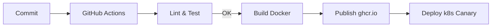

# main-server v2 彻底重构路线图（2025-08-01）

> 本文档定位为 **Greenfield v2** 重构蓝图：在保持 v1 生产运行的同时，从零搭建全新架构，采用测试驱动开发（TDD）确保质量。待核心功能达到同等甚至超越 v1 后，进行平滑迁移。

---

## 战略原则
1. **架构先行**：先设计后编码，确保可扩展与可维护。
2. **TDD**：所有功能先写测试再实现代码，覆盖率目标 ≥ 90%。
3. **渐进迁移**：v1 与 v2 并行运行，逐步切流。
4. **自动化**：从 CI/CD、格式化到部署全链路自动化。

---

## 高层架构草图
- **Layered Hexagonal / Clean Architecture**
  - `app/`     : HTTP 接入、GraphQL、CLI 等适配层
  - `domain/`  : 纯业务逻辑 (实体、值对象、聚合根、领域服务)
  - `usecase/` : 应用服务、流程编排、事务边界
  - `infra/`   : 数据库、外部 API、缓存、队列、文件系统
  - `shared/`  : 通用工具、跨切面（日志、配置、鉴权）
- **技术选型**
  - 语言：TypeScript 5.x
  - 运行时：Node.js LTS + Bun for工具脚本
  - 框架：NestJS 10 (模块化 + DI) *或* 自研轻量 DI + Router (视团队熟悉度决定)
  - ORM：Prisma 5
  - 队列：BullMQ / Redis Streams
  - 测试：Jest + Supertest + Pact  (Contract Test)
  - 打包：esbuild + Docker slim

---

## 里程碑
| Milestone | 目标 | 交付物 | 预计工期 |
|-----------|------|--------|----------|
| M0        | 基础设施就绪 | monorepo 结构、工具链、CI scaffold | 2d |
| M1        | 核心域建模   | 领域实体、用例接口定义、UML 图 | 3d |
| M2        | 框架落地     | NestJS 模块骨架 / 自研 DI 容器，启动脚本 | 3d |
| M3        | 核心用例实现 | 消息处理 pipeline v2，AI 调用 adapter | 5d |
| M4        | 外设集成     | DB migration, 外部 API client, 缓存 | 4d |
| M5        | 迁移网关     | 双写/灰度切流，流量镜像 | 3d |
| M6        | 全量迁移     | v1 停机、指标监控稳定 | 2d |

> 工期以 1 人日估算，可并行缩短；每阶段必须保持测试全绿。

---

## 任务拆解
### M0 基础设施就绪
- [ ] 引入 **pnpm workspaces**，目录结构：
  ```
  main-server/
    packages/
      core/      // domain + usecase
      adapters/  // http, queue, cli
      infra/     // prisma, redis, s3 ...
      shared/
  ```
- [ ] 配置 **eslint, prettier, lint-staged, husky**
- [ ] 创建 **GitHub Actions** CI：install → lint → test → build
- [ ] Dockerfile.multi-stage & docker-compose.override.yml (dev env)

### M1 核心域建模
- [ ] 梳理业务流程与实体：Message, Conversation, User, Task …
- [ ] 使用 **C4 Model** 生成上下文 & 容器图
- [ ] 定义领域事件 & 用例接口 (TypeScript interface)
- [ ] 输出 ADR（Architecture Decision Record）

### M2 框架落地
- [ ] 选择 & 初始化 NestJS / DI 容器
- [ ] 实现跨切面中间件：Logging, Validation, ExceptionFilter
- [ ] configuration module 统一 env 读取
- [ ] Bootstrapping: graceful shutdown, health check endpoint

### M3 核心用例实现（TDD）
- [ ] **MessagePipeline** : parse → enrich → dispatch
  - 编写失败与成功场景测试
- [ ] **AIAdapter**: 统一 LLM 调用接口, 支持 multi-vendor
- [ ] **RateLimiter**: redis token bucket (unit & integration tests)

### M4 外设集成
- [ ] **Prisma schema** + migrations script
- [ ] **Repository pattern** 接入 domain
- [ ] **ExternalWebhookAdapter** for Lark/Slack/etc.
- [ ] e2e 测试通过 docker-compose-ci

### M5 迁移网关
- [ ] 在 v1 前端/客户端侧增加 `X-API-Version` header
- [ ] 网关根据 header 将请求路由至 v2
- [ ] 监控指标：Latency, ErrorRate, Throughput
- [ ] 灰度策略：10%→25%→50%→100%

### M6 全量迁移 & 收尾
- [ ] 切流完成，关闭 v1
- [ ] 数据备份与只读模式
- [ ] 更新文档 & 交接
- [ ] 归档旧仓库 / tag v1-legacy

---

## 测试策略
1. **单元**：function/class 级，mock 依赖
2. **集成**：module 与外设交互 (db redis)
3. **契约**：对外 API pact 保证兼容性
4. **e2e**：通过 HTTP 验证主要用户路径
5. **覆盖率门槛**：90% stmt, 85% branch

---

## CI/CD Pipeline


---

## 风险与应对
| 风险 | 等级 | 缓解措施 |
| ---- | ---- | -------- |
| v2 进度拖延 | 高 | 每周里程碑 Demo & Retro |
| 需求变更 | 中 | 模块化 + 领域驱动设计，降低影响面 |
| 迁移数据不一致 | 高 | 双写 + 数据校验脚本 |
| 团队不熟悉 NestJS | 中 | 内部 workshop & code-kata |

---

## 验收标准
- [ ] v2 生产流量 100%，SLA ≥ v1
- [ ] 覆盖率 & 静态扫描通过
- [ ] ADR & 文档完备，On-call 能独立处理告警

---

### 维护者
@backend-team