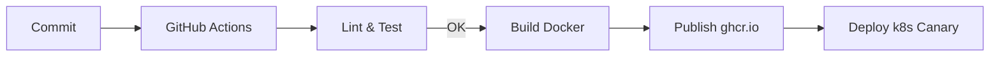

# main-server v2 彻底重构路线图（2025-08-01）

> 本文档定位为 **Greenfield v2** 重构蓝图：在保持 v1 生产运行的同时，从零搭建全新架构，采用测试驱动开发（TDD）确保质量。待核心功能达到同等甚至超越 v1 后，进行平滑迁移。

---

## 战略原则
1. **架构先行**：先设计后编码，确保可扩展与可维护。
2. **TDD**：所有功能先写测试再实现代码，覆盖率目标 ≥ 90%。
3. **渐进迁移**：v1 与 v2 并行运行，逐步切流。
4. **自动化**：从 CI/CD、格式化到部署全链路自动化。

---

## 高层架构草图
- **Layered Hexagonal / Clean Architecture**
  - `app/`     : HTTP 接入、GraphQL、CLI 等适配层
  - `domain/`  : 纯业务逻辑 (实体、值对象、聚合根、领域服务)
  - `usecase/` : 应用服务、流程编排、事务边界
  - `infra/`   : 数据库、外部 API、缓存、队列、文件系统
  - `shared/`  : 通用工具、跨切面（日志、配置、鉴权）
- **技术选型**
  - 语言：TypeScript 5.x
  - 运行时：Node.js LTS + Bun for工具脚本
  - 框架：NestJS 10 (模块化 + DI) *或* 自研轻量 DI + Router (视团队熟悉度决定)
  - ORM：Prisma 5
  - 队列：BullMQ / Redis Streams
  - 测试：Jest + Supertest + Pact  (Contract Test)
  - 打包：esbuild + Docker slim

---

## 里程碑
| Milestone | 目标 | 交付物 | 预计工期 |
|-----------|------|--------|----------|
| M0        | 基础设施就绪 | monorepo 结构、工具链、CI scaffold | 2d |
| M1        | 核心域建模   | 领域实体、用例接口定义、UML 图 | 3d |
| M2        | 框架落地     | NestJS 模块骨架 / 自研 DI 容器，启动脚本 | 3d |
| M3        | 核心用例实现 | 消息处理 pipeline v2，AI 调用 adapter | 5d |
| M4        | 外设集成     | DB migration, 外部 API client, 缓存 | 4d |
| M5        | 迁移网关     | 双写/灰度切流，流量镜像 | 3d |
| M6        | 全量迁移     | v1 停机、指标监控稳定 | 2d |

> 工期以 1 人日估算，可并行缩短；每阶段必须保持测试全绿。

---

## 任务拆解
### M0 基础设施就绪
- [ ] 引入 **pnpm workspaces**，目录结构：
  ```
  main-server/
    packages/
      core/      // domain + usecase
      adapters/  // http, queue, cli
      infra/     // prisma, redis, s3 ...
      shared/
  ```
- [ ] 配置 **eslint, prettier, lint-staged, husky**
- [ ] 创建 **GitHub Actions** CI：install → lint → test → build
- [ ] Dockerfile.multi-stage & docker-compose.override.yml (dev env)
- [ ] 创建根级 `tsconfig.base.json` 并在各 package 继承
- [ ] 安装依赖：`pnpm add -D typescript jest ts-jest @types/jest eslint prettier lint-staged husky commitizen commitlint cz-conventional-changelog`
- [ ] 在 `package.json` 添加 script：`dev`, `lint`, `test`, `test:watch`, `build`, `release`
- [ ] 编写 `.prettierrc.json`：2 空格缩进、行宽 120、单引号
- [ ] 更新 `.eslintrc.js`：启用 `@typescript-eslint`, `import/order`, `unused-imports` 规则
- [ ] `husky install` 并添加 `pre-commit`、`commit-msg` 钩子
- [ ] CI: `.github/workflows/ci.yml` Node 20 matrix，步骤：checkout→setup-pnpm→cache→install→lint→test→upload-codecov
- [ ] 新建 `Dockerfile.dev`：基于 node:20-alpine，热重载 `pnpm run dev`
- [ ] README 增加本地启动、调试、测试、CI 说明

### M1 核心域建模
- [ ] 梳理业务流程与实体：Message, Conversation, User, Task …
- [ ] 使用 **C4 Model** 生成上下文 & 容器图
- [ ] 定义领域事件 & 用例接口 (TypeScript interface)
- [ ] 输出 ADR（Architecture Decision Record）
- [ ] 召开 2h 领域研讨会，输出事件风暴白板
- [ ] 在 `docs/` 保存 `C4_Context.puml`, `C4_Container.puml`
- [ ] 定义实体：`Message`, `Conversation`, `User`, `Attachment`
- [ ] 为实体编写工厂函数与不变式校验测试
- [ ] 定义领域事件：`MessageReceived`, `ConversationClosed`, `UserMentioned`
- [ ] 在 `core/domain/events` 放置事件定义与发布接口
- [ ] 撰写三条 ADR：
  1. 采用事件驱动架构
  2. 选择 Prisma 作为 ORM
  3. Clean Architecture 分层命名约定

### M2 框架落地
- [ ] 选择 & 初始化 NestJS / DI 容器
- [ ] 实现跨切面中间件：Logging, Validation, ExceptionFilter
- [ ] configuration module 统一 env 读取
- [ ] Bootstrapping: graceful shutdown, health check endpoint
- [ ] 安装 NestJS 依赖：`@nestjs/{core,common,testing}`, `reflect-metadata`, `class-validator`
- [ ] 建立 `app.module.ts`，导入 Controllers & Providers skeleton
- [ ] 创建全局管道：`ValidationPipe`、`LoggingInterceptor`
- [ ] 配置 `ConfigModule.forRoot({ isGlobal:true, envFilePath:['.env','.env.local']})`
- [ ] `main.ts` 启动脚本：启用 CORS、graceful shutdown、swagger `@/docs`
- [ ] 编写 `health.controller.ts` 返回 build info
- [ ] 单元测试 `health.controller.spec.ts`

### M3 核心用例实现（TDD）
- [ ] **MessagePipeline** : parse → enrich → dispatch
  - 编写失败与成功场景测试
- [ ] **AIAdapter**: 统一 LLM 调用接口, 支持 multi-vendor
- [ ] **RateLimiter**: redis token bucket (unit & integration tests)
- [ ] 目录 `packages/core/usecase/message` 下建立 `pipeline.spec.ts` （红）
- [ ] Stage1 `parseService`：解析来源渠道、指令，mock transport
- [ ] Stage2 `enrichService`：填充用户 profile、会话上下文
- [ ] Stage3 `dispatchService`：调用 `AIAdapter`、返回 streaming
- [ ] `AIAdapter`：定义 `IAIProvider` 接口，具体实现 `OpenAIProvider`, `LLamaProvider`
- [ ] 提供 retry/backoff 装饰器，单元测试失败重试 3 次
- [ ] `RateLimiter`：token bucket 算法，单位时间窗口 60 req
- [ ] 为以上服务编写 mock & spies，覆盖异常分支

### M4 外设集成
- [ ] **Prisma schema** + migrations script
- [ ] **Repository pattern** 接入 domain
- [ ] **ExternalWebhookAdapter** for Lark/Slack/etc.
- [ ] e2e 测试通过 docker-compose-ci
- [ ] 定义 `prisma/schema.prisma`，entity → table（遵循 snake_case）
- [ ] `pnpm prisma migrate dev` 生成本地 sqlite 用于 CI
- [ ] 创建 `MessageRepository` with findById/save/listByConversation
- [ ] `redis.module.ts`：创建连接，导出 `RedisService`
- [ ] `ExternalWebhookAdapter`：实现 `LarkController`, 校验签名 middleware
- [ ] e2e 测试脚本：`test/e2e/message.e2e-spec.ts` 使用 supertest + sqlite memory
- [ ] 添加 `docker-compose.ci.yml`：services redis, postgres, minio

### M5 迁移网关
- [ ] 在 v1 前端/客户端侧增加 `X-API-Version` header
- [ ] 网关根据 header 将请求路由至 v2
- [ ] 监控指标：Latency, ErrorRate, Throughput
- [ ] 灰度策略：10%→25%→50%→100%
- [ ] Nginx ingress：配置 `map $http_x_api_version` 路由 v1/v2
- [ ] `k8s/deployment.yaml` 增加 v2 canary，flagger 分阶段自动放量
- [ ] 实现 `traffic-mirror` middleware 记录并对比 v1/v2 响应差异
- [ ] Prometheus & Grafana dashboard：延迟 p95、错误率、RPS
- [ ] 自动回滚脚本 on SLO breach

### M6 全量迁移 & 收尾
- [ ] 切流完成，关闭 v1
- [ ] 数据备份与只读模式
- [ ] 更新文档 & 交接
- [ ] 归档旧仓库 / tag v1-legacy
- [ ] 编写 `scripts/data-backfill.ts` 校验并补齐 v1 与 v2 数据差异
- [ ] 执行 `kubectl rollout restart` 并观察 1h
- [ ] 发版公告 & 更新内部 Wiki
- [ ] 关闭 v1 相关 CI job、归档镜像
- [ ] post-mortem：复盘本次迁移，收集改进点

---

## 测试策略
1. **单元**：function/class 级，mock 依赖
2. **集成**：module 与外设交互 (db redis)
3. **契约**：对外 API pact 保证兼容性
4. **e2e**：通过 HTTP 验证主要用户路径
5. **覆盖率门槛**：90% stmt, 85% branch

---

## CI/CD Pipeline


---

## 风险与应对
| 风险 | 等级 | 缓解措施 |
| ---- | ---- | -------- |
| v2 进度拖延 | 高 | 每周里程碑 Demo & Retro |
| 需求变更 | 中 | 模块化 + 领域驱动设计，降低影响面 |
| 迁移数据不一致 | 高 | 双写 + 数据校验脚本 |
| 团队不熟悉 NestJS | 中 | 内部 workshop & code-kata |

---

## 验收标准
- [ ] v2 生产流量 100%，SLA ≥ v1
- [ ] 覆盖率 & 静态扫描通过
- [ ] ADR & 文档完备，On-call 能独立处理告警

---

### 维护者
@backend-team