# AI服务

AI服务是Inner Bot Server的核心AI处理模块，基于FastAPI构建，提供智能聊天、文本处理和工具调用等功能。

## 概述

AI服务作为飞书机器人的"大脑"，负责处理用户的自然语言输入，通过集成OpenAI模型和丰富的工具系统，为用户提供智能化的对话体验。

### 主要功能

- **AI聊天服务**：支持流式对话，集成"赤尾"角色设定，提供拟人化的聊天体验
- **工具调用系统**：内置多种工具，支持网络搜索、数学计算、时间查询等功能
- **文本提取服务**：提供批量文本实体提取功能
- **事件系统**：支持跨服务通信和分布式处理
- **内存服务**：集成记忆检索，提供上下文感知的对话体验

## 系统架构

### 整体架构图

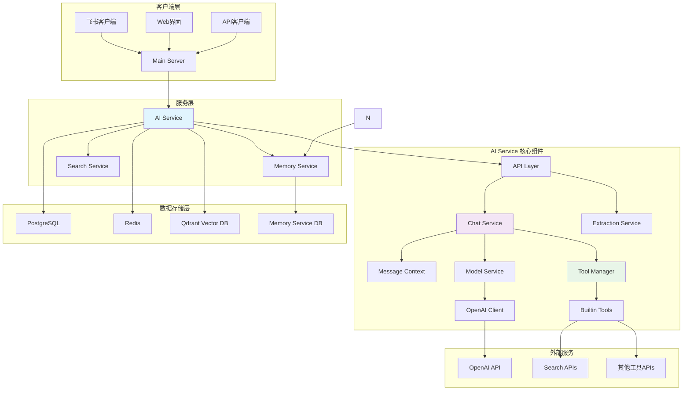

### 服务内部架构

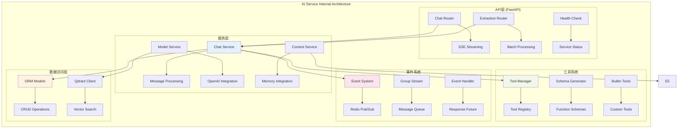

## 技术栈

- **框架**：FastAPI
- **AI模型**：OpenAI GPT系列
- **数据库**：PostgreSQL（ORM）、Qdrant（向量检索）
- **通信**：Redis（事件系统）
- **工具系统**：基于装饰器的工具注册和管理
- **工作流引擎**：LangGraph

## 数据流图

### 聊天处理流程

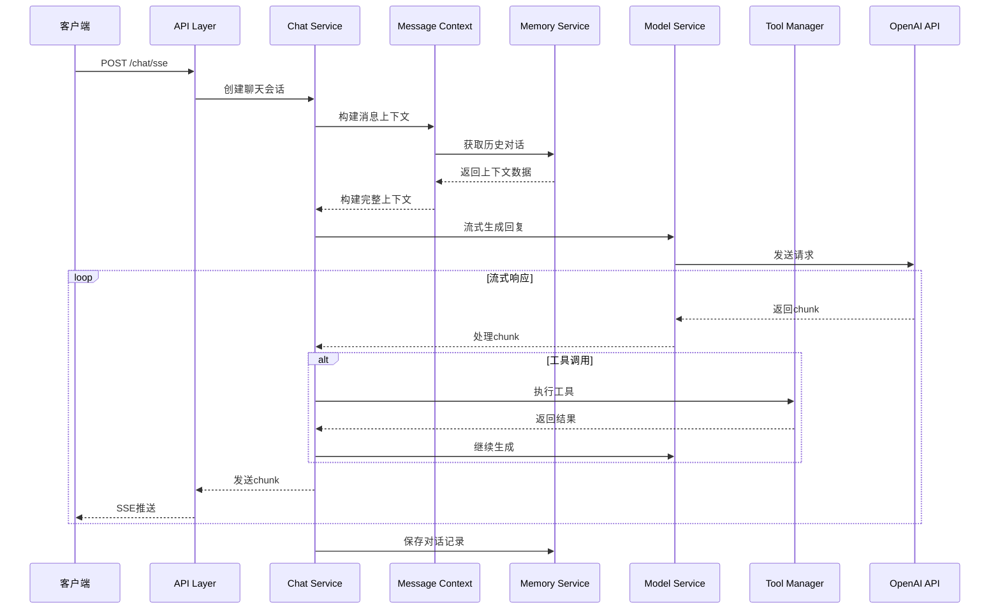

### 工具调用流程

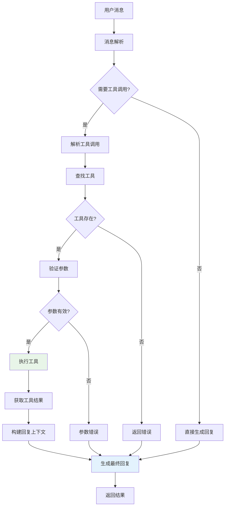

### 事件系统架构

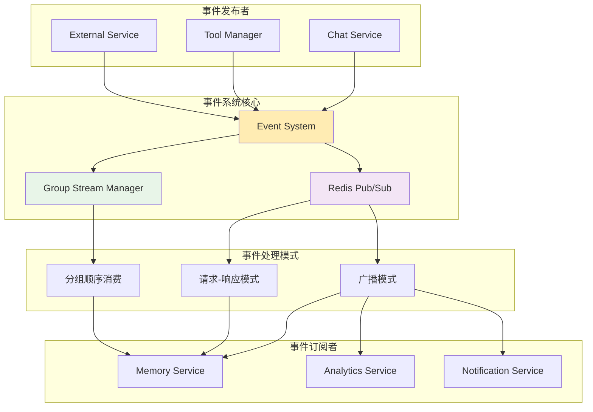

## 项目结构

```
ai-service/app/
├── api/                    # API路由层
│   ├── chat.py            # 聊天API（SSE流式接口）
│   ├── extraction.py      # 文本提取API
│   └── router.py          # 路由汇总和健康检查
├── agents/                # AI代理系统
│   └── bangumi/           # 番剧相关代理
├── config/                # 配置管理
│   ├── config.py          # 主配置文件
│   ├── logging_config.json # 日志配置
│   ├── memory_config.py   # 内存服务配置
│   ├── memory_service.py  # 内存服务实现
│   └── openai_config.py   # OpenAI配置
├── core/                  # 核心功能模块
│   ├── clients/           # 外部客户端
│   │   └── openai.py      # OpenAI客户端封装
│   ├── event_system.py    # 事件系统核心
│   ├── events.py          # 事件处理和初始化
│   ├── group_stream.py    # 分组流式处理
│   └── example_*.py       # 示例代码
├── langgraph_infra/       # LangGraph工作流引擎
│   ├── model_builder.py   # 模型构建器
│   └── exceptions.py      # 异常处理
├── orm/                   # 数据访问层
│   ├── base.py            # 基础ORM配置
│   ├── crud.py            # CRUD操作
│   └── models.py          # 数据模型定义
├── services/              # 业务服务层
│   ├── chat/              # 聊天服务
│   │   ├── context.py     # 消息上下文管理
│   │   ├── message.py     # 消息处理核心
│   │   ├── model.py       # 模型服务
│   │   ├── prompt.py      # 提示词管理
│   │   └── prompt.md      # 角色设定文件
│   ├── search/            # 搜索服务
│   │   └── web.py         # 网络搜索工具
│   ├── chat_service.py    # 聊天服务主入口
│   ├── meta_info.py       # 元信息服务
│   └── qdrant.py          # 向量数据库服务
├── tools/                 # 工具系统
│   ├── builtin_tools.py   # 内置工具集合
│   ├── decorators.py      # 工具装饰器
│   ├── manager.py         # 工具管理器
│   ├── registry.py        # 工具注册中心
│   ├── schema_generator.py # Schema生成器
│   ├── startup.py         # 启动初始化
│   └── README.md          # 工具系统详细文档
├── types/                 # 类型定义
│   ├── chat.py            # 聊天相关类型
│   └── memory.py          # 内存相关类型
├── utils/                 # 工具函数
│   ├── decorators/        # 装饰器工具
│   ├── logger/            # 日志工具
│   ├── middlewares/       # 中间件
│   └── split_word.py      # 分词工具
└── main.py                # 应用入口
```

## 核心模块详解

### API层 (api/)

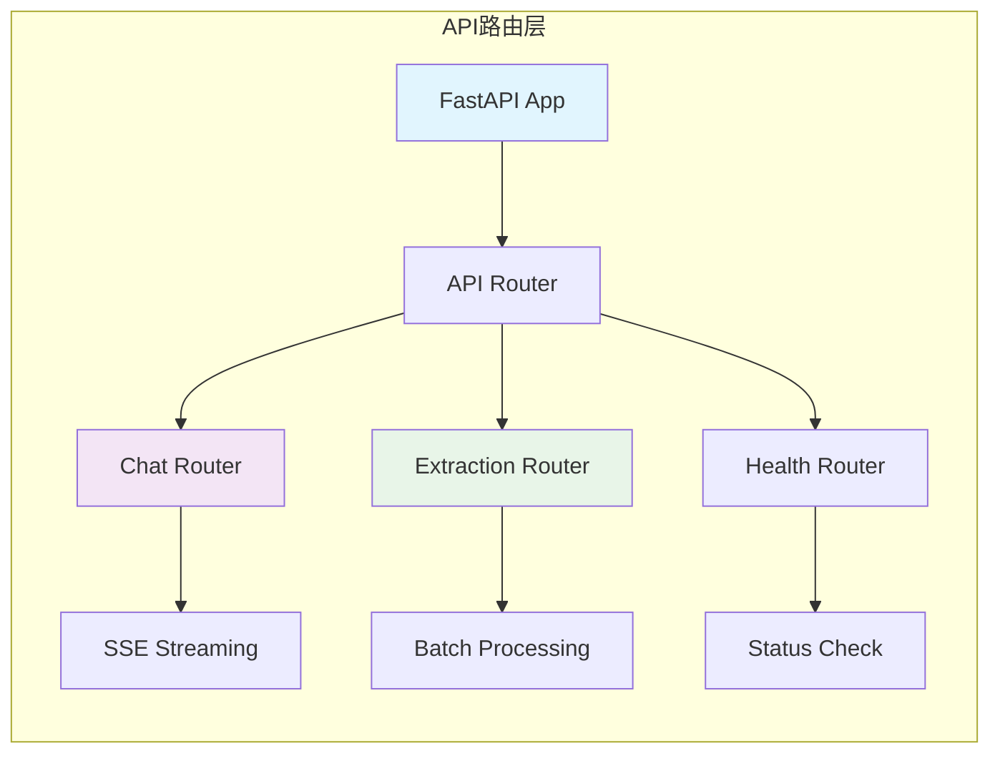

**聊天API (chat.py)**

- `/chat/sse`: SSE流式聊天接口，支持实时对话
- 支持工具调用和多轮对话
- 集成状态机管理对话流程

**文本提取API (extraction.py)**

- `/extract_batch`: 批量文本实体提取
- 支持自定义模型和参数配置

### 聊天服务架构

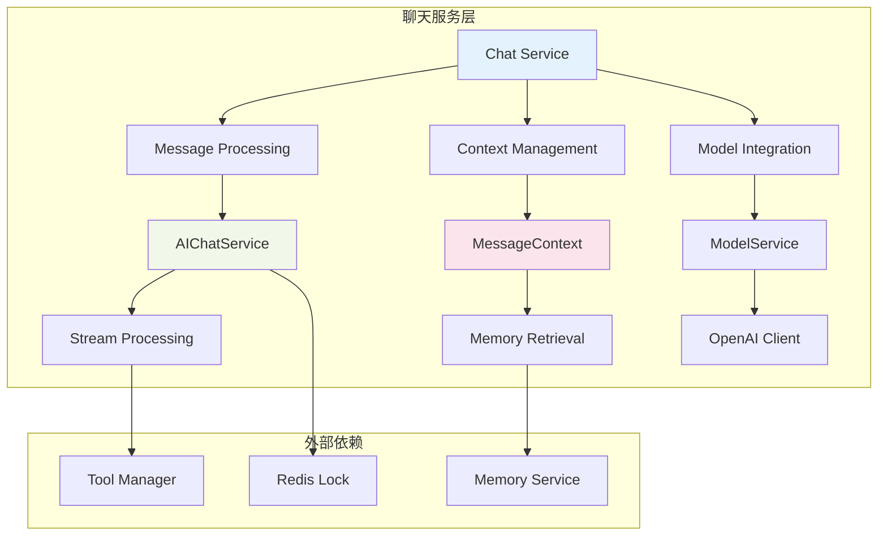

**核心组件**

- `message.py`: 聊天消息处理核心，支持流式响应和工具调用
- `context.py`: 消息上下文管理，处理对话历史和记忆检索
- `model.py`: 模型服务，管理OpenAI客户端和请求
- `prompt.py`: 提示词管理，支持动态提示词生成

**角色设定**

- 内置"赤尾"角色，一个活泼可爱的AI助手
- 支持多轮对话、工具调用和情感化交互

### 工具系统架构

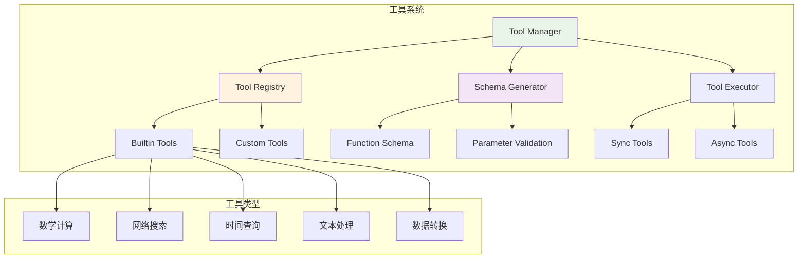

基于装饰器的工具注册和管理系统，详细文档请参考 [tools/README.md](tools/README.md)

**特性**

- 装饰器自动注册：`@tool`装饰器
- 自动Schema生成：从函数签名生成OpenAI函数调用schema
- 类型安全：基于Python类型注解
- 异步支持：同时支持同步和异步工具

**内置工具**

- 网络搜索、数学计算、时间查询
- 文本分析、数据格式转换
- 工具帮助和动态扩展

### 事件系统

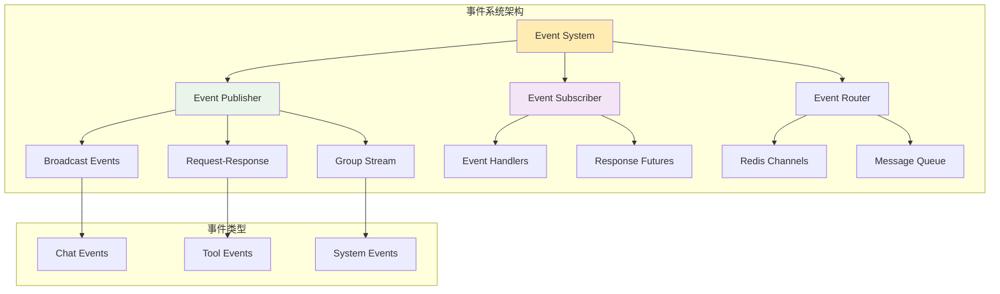

支持三种事件模式：

1. **广播模式**：通知类事件，无需响应
2. **请求-响应模式**：需要处理结果的事件
3. **分组顺序消费**：支持分组隔离和顺序处理

### 数据层架构

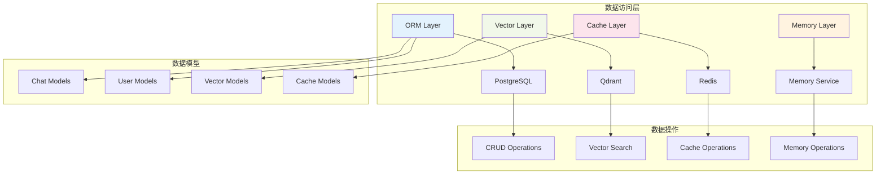

## 配置说明

### 环境变量

```bash

# 数据库配置
POSTGRES_USER=your_db_user
POSTGRES_PASSWORD=your_db_password
POSTGRES_DB=your_db_name
POSTGRES_HOST=localhost

# Redis配置
REDIS_HOST=localhost
REDIS_PORT=6379
REDIS_PASSWORD=your_redis_password

# 内存服务配置
MEMORY_BASE_URL=http://localhost:8002

# 搜索服务配置
SEARCH_API_KEY=your_search_key
```

### 配置文件

- `config/config.py`: 主配置文件，使用pydantic_settings管理
- `config/logging_config.json`: 日志配置
- `config/memory_config.py`: 内存服务配置

## 启动服务

### 开发环境

```bash
# 安装依赖
pip install -r requirements.txt

# 启动服务
uvicorn app.main:app --reload --host 0.0.0.0 --port 8000
```

### 生产环境

```bash
# 使用Docker
docker build -t ai-service .
docker run -p 8000:8000 ai-service
```

## API文档

启动服务后，访问以下地址查看API文档：

- Swagger UI: `http://localhost:8000/docs`
- ReDoc: `http://localhost:8000/redoc`

## 健康检查

```bash
# 检查服务状态
curl http://localhost:8000/health

# 响应示例
{
    "status": "ok",
    "timestamp": "2024-01-01T12:00:00Z",
    "service": "ai-service"
}
```

## 开发指南

### 服务启动流程

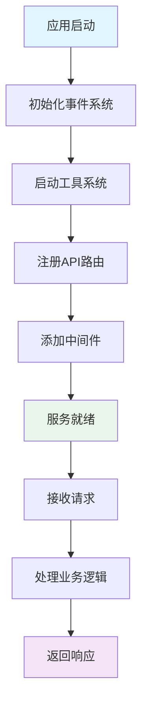

### 添加新工具

```python
from app.tools import tool

@tool(description="你的工具描述")
async def your_tool(param: str) -> str:
    """
    工具功能说明
    
    Args:
        param: 参数说明
        
    Returns:
        结果说明
    """
    # 实现你的工具逻辑
    return f"处理结果: {param}"
```

### 扩展聊天功能

1. 修改 `services/chat/prompt.md` 调整角色设定
2. 在 `services/chat/context.py` 中扩展上下文处理
3. 在 `services/chat/message.py` 中添加新的消息处理逻辑

### 事件处理

```python
from app.core import get_event_system

# 获取事件系统
event_system = get_event_system()

# 注册事件处理器
@event_system.subscribe("your.event")
async def handle_event(data):
    # 处理事件
    pass

# 发布事件
await event_system.publish("your.event", {"data": "value"})
```

## 性能优化

### 优化策略图

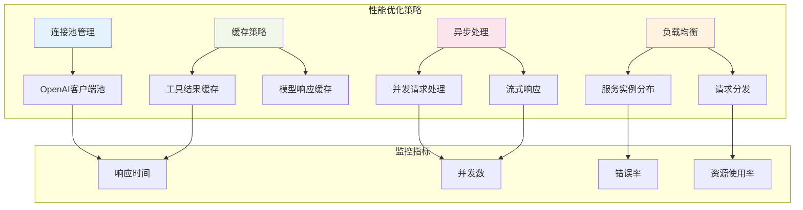

- 使用连接池管理OpenAI客户端
- 支持模型缓存和请求合并
- 异步处理提高并发性能
- 工具调用结果缓存

## 监控和日志

- 结构化日志记录
- 请求追踪和性能监控
- 错误处理和重试机制
- 健康检查和服务状态监控

### 监控架构

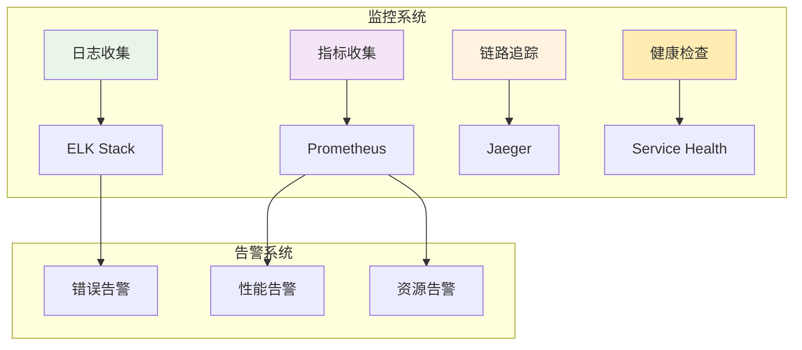

## 部署架构

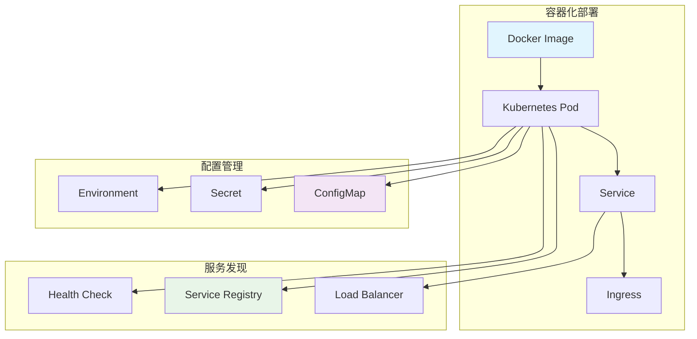
