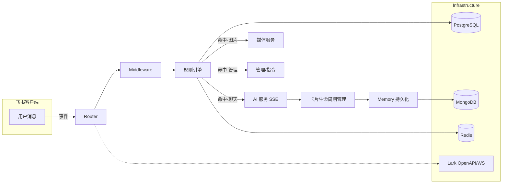
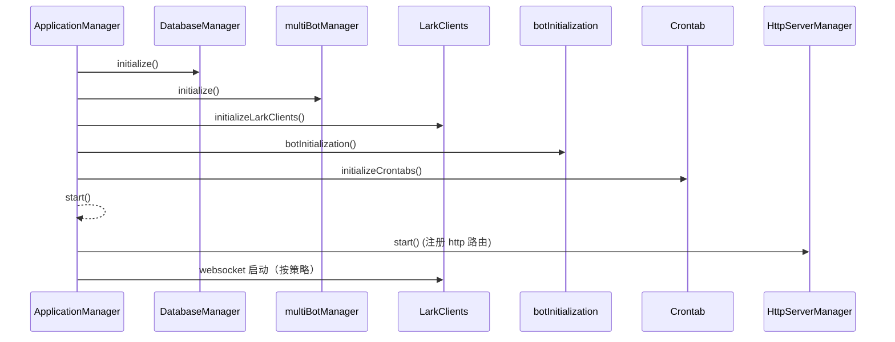
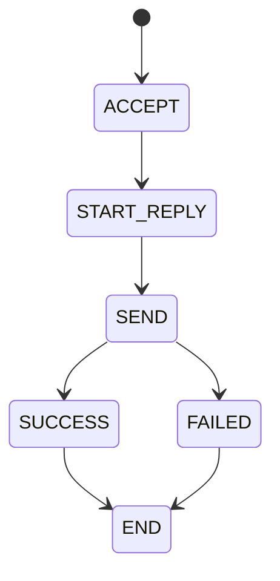

# Main Server (主服务)

本项目为内部机器人系统的核心后端，基于 Koa.js 与 TypeScript。职责包括：
- 处理飞书（Lark）事件回调与消息交互
- 执行业务规则与 AI 对话流程
- 管理持久化与缓存
- 对外提供管理/健康检查等 HTTP 接口

## 架构概览

采用模块化设计，职责清晰、便于维护。

- **api**：HTTP 路由（如图片处理接口）
- **core**：领域内的模型、规则与服务（AI对话、媒体处理）
- **infrastructure**：底层设施（缓存、DAL、HTTP、外部集成、日志）
- **middleware**：Koa 中间件（链路追踪、上下文注入、参数校验）
- **startup**：应用启动/关闭编排
- **types**：类型定义（AI、聊天、Lark、Mongo 等）
- **utils**：工具库（状态机、文本处理、限流、SSE 客户端等）

### 系统组件关系（Mermaid）

## 启动流程

## 技术栈

- Node.js + TypeScript + Koa.js
- PostgreSQL（主数据）、MongoDB（消息存储）、Redis（缓存/锁/Stream）
- TypeORM（PostgreSQL）、ioredis
- 飞书 OpenAPI SDK（HTTP/WS）
- Docker

## 配置

请将仓库根目录的 .env.example 复制为 .env 并按需填写。关键项：
- 数据库：POSTGRES_* / MONGO_* / REDIS_*
- AI 服务：AI_SERVER_HOST / AI_SERVER_PORT
- 代理/日志：PROXY_* / LOG_LEVEL 等

## 核心流程与算法

### 1) 规则引擎（runRules）
- 以数组方式维护规则集，支持同步规则（rules）与异步规则（async_rules）。所有规则通过后执行对应 handler；可通过 fallthrough 控制继续匹配。
- 典型功能：复读检测、余额/帮助、撤回、水群统计、发图、Meme检测、AI聊天卡片回复。

### 2) 聊天状态机 + SSE 流式对话
- 有限状态：ACCEPT → START_REPLY → SEND → SUCCESS/FAILED → END。
- SSE 客户端具备自动重连、重试、分段解析；状态机在 onMessage 中驱动回调（status/think/text），最终通过 onSaveMessage 持久化。
- 卡片生命周期：通过 CardLifecycleManager 回调创建/更新卡片；支持失败重试（reCreateCard）。

### 3) 水群历史卡片统计
- 并发拉取历史消息（按时间区间切分），构建近 7 天活跃趋势与分时段柱状图；基于本周与上周的消息聚合计算龙王榜排名变化；过滤超链与 emoji 后生成词云。

### 4) 复读检测
- 文本/贴纸内容进行 MD5 哈希，按群维度在 Redis 中计数；同一内容在群内累计出现 3 次即触发复读。支持开关更新（permission_config 合并）。

### 5) 通用状态机框架（可扩展）
- 提供状态转换校验、必需处理器等待、并发转换队列、状态栈与上下文元数据，供复杂流程参考与复用。

### 6) 分布式锁装饰器（RedisLock）
- 方法装饰器形式，支持动态 key、ttl/timeout/retryInterval，释放锁使用 Lua 脚本原子化保障。

## 中间件与上下文
- traceMiddleware：生成/传递 X-Trace-Id，贯穿请求生命周期（AsyncLocalStorage）。
- context：获取/设置 traceId、botName；HTTP 客户端与 AI SSE 请求注入头部（X-Trace-Id、X-App-Name）。
- validation：通用校验工具（必填/类型/长度/正则/自定义），为图片处理等接口提供安全防线。

## 集成与路由
- HTTP 模式：通过 HttpRouterManager 为每个 bot 创建事件/卡片路由，适配 Koa。
- WebSocket 模式：WebSocketManager 注册事件处理器、启动 WSClient 并注入上下文装饰器。
- 健康检查：/api/health 返回 bot 与服务状态。

## 特殊用法与约定
- 规则划分：同步轻校验；异步外部依赖校验（如 meme）。命中控制通过 fallthrough 防重复响应。
- 时区约定：统计统一转东八区，保持报表一致。
- AI 服务地址：源自环境变量；SSE 失败确保 onFailed 调用并 forceEnd 状态机。
- 资源下载权限：消息 toMarkdown 受群下载权限影响。
- 日志与 console 覆盖：无需将 `console.*` 统一替换为 `logger.*`。当启用文件日志（`ENABLE_FILE_LOGGING=true`）且默认开启控制台重写时，系统会自动将 `console.log/info/warn/error` 代理到 winston 并注入 traceId；开发态未启用文件日志则不覆盖。详细说明见 `main-server/src/infrastructure/logger/README.md`。

## 最佳实践
- 规则命中应单一、明确，避免过度 fallthrough。
- 异步规则需设定超时与异常兜底，防止阻塞主流程。
- RedisLock 合理设置 ttl/timeout；对写操作尽可能采用条件更新与幂等处理。
- 路由与中间件顺序：trace → botContext → body parser，保证上下文与追踪一致。
- 日志配置：设置 `LOG_LEVEL`，按需开启 `ENABLE_FILE_LOGGING` 与 `LOG_DIR`；确保 `traceMiddleware` 前置以输出正确 traceId。

## 扩展指引
- 新增规则：在 core/rules 下添加规则与 handler，并加入规则集；需要 AI 时复用 sseChat 与 onSaveMessage 钩子。
- 扩展状态机：新增 Step 与 transitions，并按需注册 required 处理器。
- 新报表卡片：复用并行查询与分组逻辑，结合 feishu-card 组件产出图表与表格。
