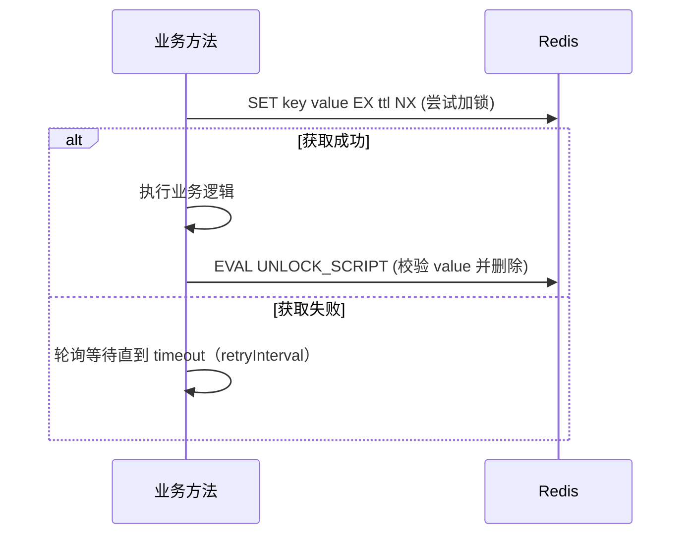

# 缓存与并发控制

统一介绍缓存装饰器、Redis 客户端能力，以及分布式锁与 Stream 的使用方式。

## 目录结构

```
infrastructure/cache/
├── redis-client.ts  # Redis 客户端封装（连接、发布订阅、Stream、Lua）
├── redis-lock.ts    # 分布式锁装饰器（Lua 原子解锁）
└── README.md
```

## Redis 客户端能力（摘要）

- 连接管理：主连接与订阅连接分离，支持重试策略
- KV：get/set/setWithExpire/del/exists/setNx
- 发布订阅：publish/subscribe/psubscribe（带多 handler 管理）
- Stream：xadd/xread/xreadgroup/xack/xdel/xgroup
- Lua：evalScript 执行原子脚本

## 分布式锁（Mermaid）



### 使用示例

```typescript
import { RedisLock } from './redis-lock';

class ReportService {
  @RedisLock({ key: (id: string) => `lock:report:${id}`, ttl: 30, timeout: 5000 })
  async generate(id: string) {
    // 生成报表的幂等逻辑
  }
}
```

## 发布订阅与 Stream 建议

- 订阅：为每个频道维护 handler 集合，动态增删，避免重复监听
- 模式订阅：使用 psubscribe，并在注册前清理旧的 pmessage 监听器
- Stream：结合消费者组进行可靠消费，处理完成后 xack；必要时引入死信队列

## 最佳实践

- 锁 ttl/timeout 合理设置：防止长时间占锁与假死
- Lua 解锁必须校验 value：避免误删他人锁
- 对幂等任务优先使用条件更新，减少锁依赖
