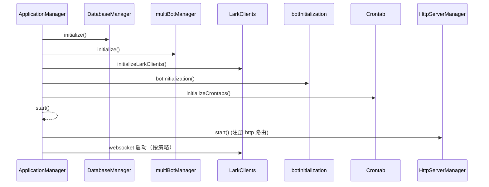

# 启动模块 (Startup Module)

负责应用的初始化、启动与优雅关闭，面向主服务的生命周期编排。

## 目录结构

```
startup/
├── application.ts      # 应用程序管理器（生命周期编排）
├── database.ts         # 数据库初始化/关闭
├── server.ts           # Koa HTTP 服务器管理
└── README.md
```

## 启动编排（Mermaid）



## 关键职责

- 初始化：数据库、多机器人管理器、Lark 客户端池
- 启动：WebSocket 服务（按策略）、HTTP 服务（按路由配置）
- 关闭：处理 SIGINT/SIGTERM，优雅释放资源（DB/Redis 等）
- 可观察性：打印当前加载的机器人配置与路由列表

## 使用示例

```typescript
// src/index.ts
import { ApplicationManager, createDefaultConfig, setupProcessHandlers } from './startup/application';

(async () => {
  const config = createDefaultConfig();
  const app = new ApplicationManager(config);
  setupProcessHandlers(app);
  await app.initialize();
  await app.start();
})();
```
