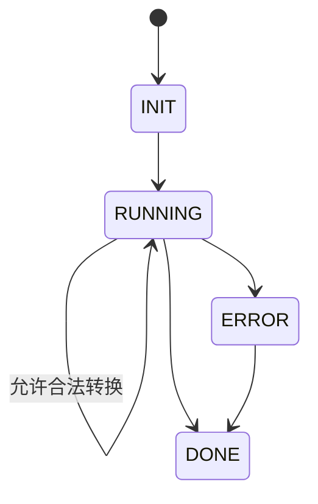

# Utils (工具函数)

通用工具库，按功能分类组织，统一为主服务提供可复用能力。

本目录仅包含**纯工具函数**，不依赖业务实体。业务相关的工具已迁移到 `core/services/`。

## 目录结构

```text
utils/
├── rate-limiting/  # 请求限流（通用）
├── sse/            # SSE 客户端（通用）
├── state-machine/  # 通用状态机
└── text/           # 文本处理工具（纯函数）
    └── text-utils.ts  # 文本清理、去除 emoji 等
```

## 已迁移到 core/services/ 的模块

以下模块因依赖业务实体，已迁移至 `core/services/`：

- `bot/` → `core/services/bot/` - 机器人配置管理
- `text/jieba.ts` → `core/services/text-analytics/` - 分词与词云（依赖外部 AI 服务）
- `text/post-content-processor.ts` → `core/services/message/` - 消息内容处理（依赖 emoji 服务）

## 状态机（state-machine）



**特性：**

- 转换合法性校验
- 必需处理器等待
- 并发队列管理
- 状态栈与上下文元数据

**用途：** 复杂流程（例如聊天状态机、卡片生命周期流）的统一抽象

**使用示例：** 参考 `core/services/ai/chat-state-machine.ts`

## 限流器（rate-limiting）

**特性：**

- 滑动窗口限流算法
- 支持多级限流（每秒、每分钟等）
- 基于 Mutex 的并发安全
- 超时控制

**使用示例：** 参考 `infrastructure/integrations/lark/basic/message.ts`

## SSE 客户端（sse）

**特性：**

- 自动重连与重试：失败后按策略重试；支持自定义次数与间隔
- 流解析：兼容不同换行符，支持多 data 行合并后 JSON 解析
- 清理函数：返回关闭连接的函数，便于上层控制生命周期

**使用示例：** 参考 `core/services/ai/chat.ts`

## 文本处理（text）

**text-utils.ts** - 纯函数文本工具：

- `clearText(text: string)`: 清理文本（去除 @提及、多余空格）
- `removeEmoji(text: string)`: 去除 emoji 表情

**使用示例：** 参考 `core/models/message-content.ts`
