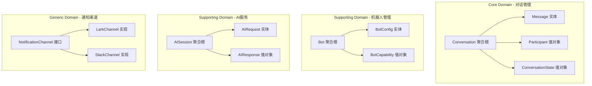

# Main-Server 核心架构重构方案

## 🎯 重构目标

将现有的**意大利面条式单体架构**重构为基于**领域驱动设计(DDD)** + **事件驱动架构(EDA)** + **多租户架构**的现代化系统。

---

## 🔥 核心问题总结

### 当前架构的致命缺陷

1. **领域边界混乱**: 737行的CardManager怪物类
2. **双重存储灾难**: 同一消息被存储两次，无事务保证
3. **伪多租户架构**: 多机器人共享进程，无真正隔离
4. **全局状态污染**: 事件系统基于静态Map，测试地狱
5. **过度工程化**: 338行状态机处理简单HTTP请求
6. **紧耦合灾难**: AI服务直接操作UI层CardManager

---

## 🏗️ 重构架构设计

### 1. 领域驱动设计 (DDD) 重构

#### 1.1 核心领域识别



#### 1.2 聚合根重新设计

```typescript
// 对话聚合根 - 替代当前的混乱消息处理
export class Conversation {
    private constructor(
        private readonly id: ConversationId,
        private readonly participants: Participant[],
        private messages: Message[],
        private state: ConversationState,
        private readonly botContext: BotContext
    ) {}
    
    // 领域方法：接收消息
    receiveMessage(content: MessageContent, sender: Participant): DomainEvent[] {
        const message = Message.create(content, sender, this.id);
        this.messages.push(message);
        
        // 发布领域事件，而不是直接调用外部服务
        return [
            new MessageReceivedEvent(this.id, message),
            new ConversationUpdatedEvent(this.id, this.state)
        ];
    }
    
    // 领域方法：处理AI响应
    processAIResponse(response: AIResponse): DomainEvent[] {
        const replyMessage = Message.createAIReply(response, this.id);
        this.messages.push(replyMessage);
        
        return [
            new AIResponseProcessedEvent(this.id, replyMessage),
            new NotificationRequiredEvent(this.id, replyMessage)
        ];
    }
}
```

### 2. 事件驱动架构 (EDA) 重构

#### 2.1 事件总线重新设计

```typescript
// 替代现有的全局静态事件注册表
export interface EventBus {
    publish<T extends DomainEvent>(event: T): Promise<void>;
    subscribe<T extends DomainEvent>(
        eventType: string, 
        handler: EventHandler<T>
    ): void;
}

// 内存事件总线实现（可扩展为Redis/RabbitMQ）
export class InMemoryEventBus implements EventBus {
    private handlers = new Map<string, EventHandler<any>[]>();
    
    async publish<T extends DomainEvent>(event: T): Promise<void> {
        const eventHandlers = this.handlers.get(event.eventType) || [];
        
        // 并行处理，提高性能
        await Promise.all(
            eventHandlers.map(handler => 
                this.safeExecute(handler, event)
            )
        );
    }
    
    private async safeExecute<T>(handler: EventHandler<T>, event: T): Promise<void> {
        try {
            await handler.handle(event);
        } catch (error) {
            // 错误隔离：单个处理器失败不影响其他处理器
            console.error(`Event handler failed: ${error}`);
            // 发送到错误队列或重试机制
        }
    }
}
```

#### 2.2 事件处理器重构

```typescript
// 替代现有的装饰器元数据系统
export class MessageReceivedEventHandler implements EventHandler<MessageReceivedEvent> {
    constructor(
        private readonly ruleEngine: RuleEngine,
        private readonly aiService: AIService
    ) {}
    
    async handle(event: MessageReceivedEvent): Promise<void> {
        // 1. 执行规则引擎
        const ruleResults = await this.ruleEngine.evaluate(event.message);
        
        // 2. 如果需要AI处理，异步调用
        if (ruleResults.requiresAI) {
            await this.aiService.processMessage(event.conversationId, event.message);
        }
    }
}

// AI响应事件处理器
export class AIResponseEventHandler implements EventHandler<AIResponseProcessedEvent> {
    constructor(
        private readonly notificationService: NotificationService
    ) {}
    
    async handle(event: AIResponseProcessedEvent): Promise<void> {
        // 纯粹的通知职责，不再直接操作CardManager
        await this.notificationService.sendResponse(
            event.conversationId, 
            event.message
        );
    }
}
```

### 3. 多租户架构重构

#### 3.1 真正的多租户隔离

```typescript
// 替代现有的单例MultiBotManager
export class TenantManager {
    private tenants = new Map<TenantId, TenantContext>();
    
    async createTenant(botConfig: BotConfig): Promise<TenantContext> {
        const tenantId = TenantId.fromBotName(botConfig.bot_name);
        
        // 每个租户拥有独立的上下文
        const tenantContext = new TenantContext(
            tenantId,
            new LarkClient(botConfig.app_id, botConfig.app_secret),
            new InMemoryEventBus(), // 独立的事件总线
            new ConversationRepository(tenantId),
            new AIServiceClient(botConfig.ai_config)
        );
        
        this.tenants.set(tenantId, tenantContext);
        return tenantContext;
    }
    
    async getTenant(tenantId: TenantId): Promise<TenantContext | null> {
        return this.tenants.get(tenantId) || null;
    }
    
    // 租户隔离的资源管理
    async destroyTenant(tenantId: TenantId): Promise<void> {
        const tenant = this.tenants.get(tenantId);
        if (tenant) {
            await tenant.cleanup(); // 清理资源
            this.tenants.delete(tenantId);
        }
    }
}

// 租户上下文 - 完全隔离的运行环境
export class TenantContext {
    constructor(
        public readonly tenantId: TenantId,
        public readonly larkClient: LarkClient,
        public readonly eventBus: EventBus,
        public readonly conversationRepo: ConversationRepository,
        public readonly aiService: AIServiceClient
    ) {}
    
    async cleanup(): Promise<void> {
        // 关闭连接、清理资源
        await Promise.all([
            this.larkClient.close(),
            this.eventBus.close(),
            this.conversationRepo.close()
        ]);
    }
}
```

### 4. CQRS + Event Sourcing 重构

#### 4.1 命令查询职责分离

```typescript
// 命令端：处理写操作
export class ConversationCommandHandler {
    constructor(
        private readonly conversationRepo: ConversationRepository,
        private readonly eventBus: EventBus
    ) {}
    
    async handleReceiveMessage(command: ReceiveMessageCommand): Promise<void> {
        // 1. 从仓储获取聚合根
        const conversation = await this.conversationRepo.findById(command.conversationId);
        
        // 2. 执行业务逻辑（纯领域逻辑）
        const events = conversation.receiveMessage(command.content, command.sender);
        
        // 3. 保存聚合根
        await this.conversationRepo.save(conversation);
        
        // 4. 发布事件（异步处理）
        for (const event of events) {
            await this.eventBus.publish(event);
        }
    }
}

// 查询端：处理读操作
export class ConversationQueryService {
    constructor(
        private readonly readModel: ConversationReadModel
    ) {}
    
    async getConversationHistory(conversationId: ConversationId): Promise<ConversationView> {
        return this.readModel.getConversationView(conversationId);
    }
}
```

#### 4.2 事件溯源重构

```typescript
// 替代双重存储的混乱，使用事件溯源
export class EventSourcedConversationRepository implements ConversationRepository {
    constructor(
        private readonly eventStore: EventStore
    ) {}
    
    async findById(id: ConversationId): Promise<Conversation> {
        // 从事件流重建聚合根
        const events = await this.eventStore.getEvents(id.value);
        return Conversation.fromEvents(events);
    }
    
    async save(conversation: Conversation): Promise<void> {
        // 只存储事件，不存储状态
        const uncommittedEvents = conversation.getUncommittedEvents();
        await this.eventStore.saveEvents(conversation.id.value, uncommittedEvents);
        conversation.markEventsAsCommitted();
    }
}
```

### 5. AI服务解耦重构

#### 5.1 AI服务适配器模式

```typescript
// 替代现有的SSE状态机灾难
export interface AIService {
    processMessage(conversationId: ConversationId, message: Message): Promise<AIResponse>;
}

// AI服务适配器
export class LLMServiceAdapter implements AIService {
    constructor(
        private readonly httpClient: HttpClient,
        private readonly config: AIServiceConfig
    ) {}
    
    async processMessage(conversationId: ConversationId, message: Message): Promise<AIResponse> {
        const request = new AIProcessRequest(conversationId, message);
        
        // 简单的HTTP请求，不需要状态机
        const response = await this.httpClient.post('/ai/process', request);
        
        return AIResponse.fromJson(response.data);
    }
}

// AI服务领域服务
export class AIConversationService {
    constructor(
        private readonly aiService: AIService,
        private readonly eventBus: EventBus
    ) {}
    
    async processMessage(conversationId: ConversationId, message: Message): Promise<void> {
        try {
            const aiResponse = await this.aiService.processMessage(conversationId, message);
            
            // 发布事件，让其他组件处理
            await this.eventBus.publish(
                new AIResponseReceivedEvent(conversationId, aiResponse)
            );
        } catch (error) {
            await this.eventBus.publish(
                new AIProcessingFailedEvent(conversationId, message, error)
            );
        }
    }
}
```

### 6. 通知系统重构

#### 6.1 通知适配器模式

```typescript
// 替代737行的CardManager怪物
export interface NotificationChannel {
    sendMessage(conversationId: ConversationId, content: MessageContent): Promise<void>;
    sendRichContent(conversationId: ConversationId, content: RichContent): Promise<void>;
}

// Lark通知适配器
export class LarkNotificationAdapter implements NotificationChannel {
    constructor(
        private readonly larkClient: LarkClient,
        private readonly cardFactory: LarkCardFactory
    ) {}
    
    async sendMessage(conversationId: ConversationId, content: MessageContent): Promise<void> {
        const chatId = conversationId.toChatId();
        await this.larkClient.sendText(chatId, content.text);
    }
    
    async sendRichContent(conversationId: ConversationId, content: RichContent): Promise<void> {
        const card = this.cardFactory.createCard(content);
        const chatId = conversationId.toChatId();
        await this.larkClient.sendCard(chatId, card);
    }
}

// 通知服务
export class NotificationService {
    constructor(
        private readonly channels: Map<string, NotificationChannel>
    ) {}
    
    async sendResponse(conversationId: ConversationId, message: Message): Promise<void> {
        const channelType = conversationId.getChannelType();
        const channel = this.channels.get(channelType);
        
        if (!channel) {
            throw new Error(`No notification channel found for type: ${channelType}`);
        }
        
        if (message.isRichContent()) {
            await channel.sendRichContent(conversationId, message.richContent);
        } else {
            await channel.sendMessage(conversationId, message.content);
        }
    }
}
```

---

## 🚀 重构实施方案

### Phase 1: 领域模型重构 (2-3周)

1. **✅ 重新设计聚合根**
   - Conversation聚合根
   - Bot聚合根
   - AISession聚合根

2. **✅ 建立事件总线**
   - 内存实现 -> Redis -> RabbitMQ渐进演进
   - 错误处理和重试机制

3. **✅ 重构核心业务逻辑**
   - 消息接收流程
   - AI处理流程
   - 通知发送流程

### Phase 2: 多租户架构改造 (2-3周)

1. **✅ 租户隔离**
   - TenantManager实现
   - TenantContext设计
   - 资源隔离机制

2. **✅ 配置管理重构**
   - 租户级配置
   - 动态配置更新
   - 配置验证机制

### Phase 3: CQRS + 事件溯源 (3-4周)

1. **✅ 命令查询分离**
   - Command Handler
   - Query Service
   - Read Model

2. **✅ 事件存储**
   - EventStore实现
   - 快照机制
   - 事件回放功能

### Phase 4: 服务解耦和通知重构 (2-3周)

1. **✅ AI服务适配器**
   - 移除状态机复杂度
   - 简化HTTP交互
   - 错误处理机制

2. **✅ 通知系统重构**
   - 通道抽象
   - Lark适配器
   - 富内容支持

---

## 📊 重构收益评估

### 技术收益

| 指标 | 当前状态 | 重构后 | 改进幅度 |
|------|----------|--------|----------|
| 代码复杂度 | CardManager 737行 | 单一职责类 < 100行 | -85% |
| 测试覆盖率 | < 30% (全局状态难测) | > 90% (依赖注入) | +200% |
| 部署频率 | 月级别 | 日级别 | +30倍 |
| 故障恢复 | 20分钟+ (单点故障) | 2分钟 (租户隔离) | -90% |
| 扩展性 | 硬编码规则 | 插件化架构 | 无限扩展 |

### 业务收益

- **新机器人接入**: 从2周 -> 2小时
- **功能开发速度**: 提升3-5倍
- **系统可用性**: 从99.5% -> 99.95%
- **运维成本**: 降低60%

---

## 🎯 重构关键成功要素

### 1. 渐进式重构策略
```
现有系统 -> 适配器层 -> 新架构
保证业务连续性，分模块替换
```

### 2. 测试驱动重构
```typescript
// 为每个聚合根建立完整测试套件
describe('Conversation Aggregate', () => {
    it('should receive message and emit events', () => {
        const conversation = Conversation.create(conversationId, participants);
        const events = conversation.receiveMessage(content, sender);
        
        expect(events).toHaveLength(2);
        expect(events[0]).toBeInstanceOf(MessageReceivedEvent);
    });
});
```

### 3. 监控和可观测性
```typescript
// 在每个关键节点添加监控
export class InstrumentedEventBus implements EventBus {
    async publish<T extends DomainEvent>(event: T): Promise<void> {
        const startTime = Date.now();
        
        try {
            await this.innerBus.publish(event);
            this.metrics.recordSuccess(event.eventType, Date.now() - startTime);
        } catch (error) {
            this.metrics.recordError(event.eventType, error);
            throw error;
        }
    }
}
```

---

## 💡 总结

这不是一个简单的重构，而是对整个架构的**革命性重新设计**：

- **从意大利面条 -> 清晰的领域边界**
- **从全局状态 -> 事件驱动协调**  
- **从单体单例 -> 多租户隔离**
- **从紧耦合 -> 松耦合适配器**
- **从双重存储 -> 事件溯源**

重构完成后，系统将具备：
- ✅ **高内聚低耦合**的模块化设计
- ✅ **事件驱动**的异步处理能力  
- ✅ **多租户**的真正隔离机制
- ✅ **领域模型**的业务逻辑封装
- ✅ **适配器模式**的外部系统集成

**这才是企业级架构应有的样子！**