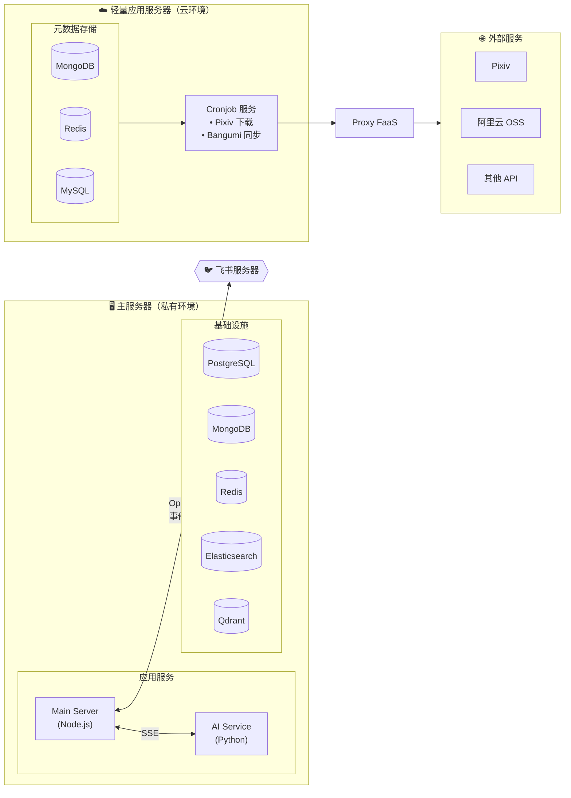
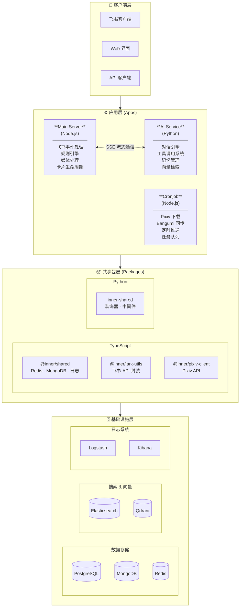
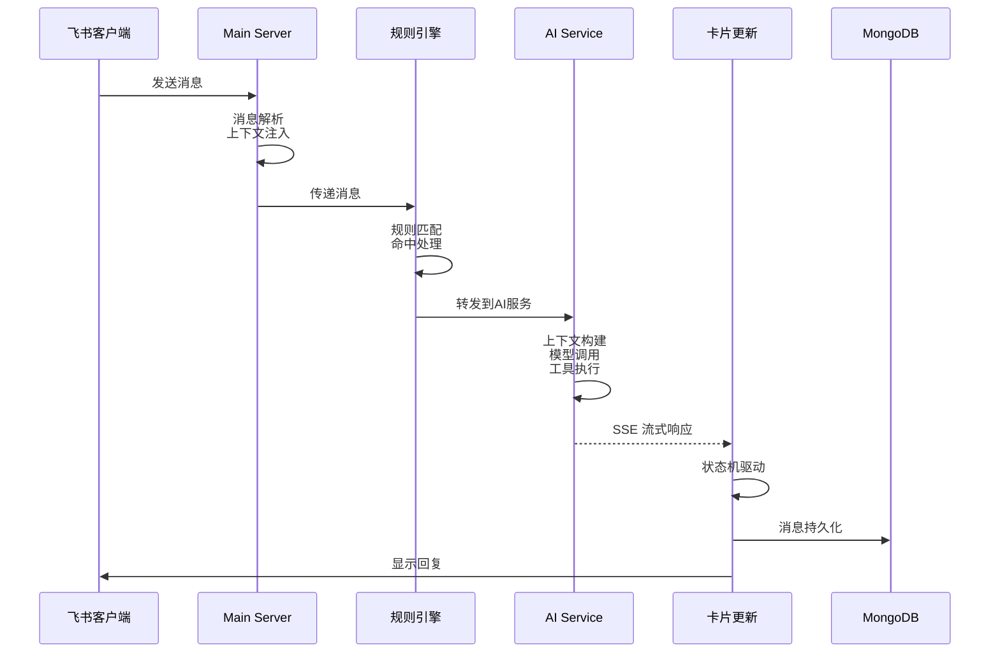
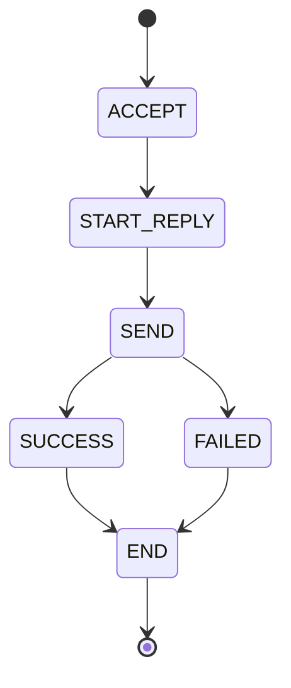
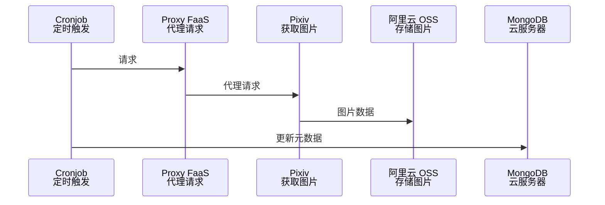
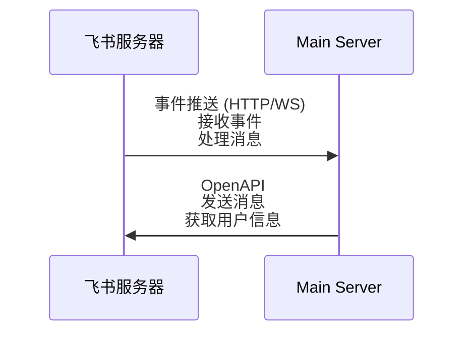
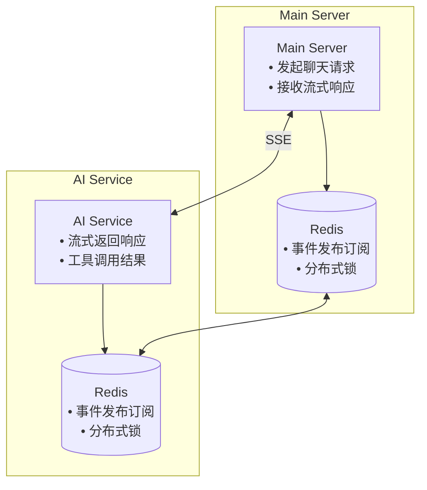

# 项目架构

本文档详细描述 Inner Bot Server 的系统架构、各服务之间的关系、数据流和核心设计。

## 部署架构概览

项目采用**双服务器部署**模式，服务分布在两个不同的环境中：



### 服务器职责

| 服务器 | 部署内容 | 配置文件 | 说明 |
|--------|----------|----------|------|
| **主服务器** | Main Server, AI Service, 基础设施 | `docker-compose.yml` | 处理飞书机器人核心业务 |
| **轻量应用服务器** | 元数据存储服务 | `docker-compose.cloud.yml` | 提供 MongoDB/Redis/MySQL |
| **轻量应用服务器** | Cronjob 服务 | `apps/cronjob/docker-compose.yml` | 定时任务，单独部署 |

### 数据流说明

1. **飞书 ↔ 主服务器**：
   - 飞书通过 HTTP 或 WebSocket 推送事件（消息、进出群等）到 Main Server
   - Main Server 调用飞书 OpenAPI 发送消息、获取用户信息等

2. **Cronjob → 外部 API**：
   - Cronjob 通过 Proxy FaaS 访问 Pixiv 等外部 API（防封禁）
   - 下载的图片存储到阿里云 OSS

3. **Cronjob ↔ 元数据存储**：
   - Cronjob 直接连接同一台服务器上的 MongoDB 和 Redis

4. **主服务器 ↔ Cronjob**：
   - 两者不直接通信，通过数据库共享数据

---

## 整体架构

Inner Bot Server 采用 **微服务架构 + 事件驱动** 模式，由三个主要应用服务和多个共享包组成。



---

## 服务详解

### 1. Main Server (主服务)

**技术栈**: Node.js + TypeScript + Koa.js + TypeORM

**部署位置**: 主服务器

**职责**:
- 处理飞书事件回调（消息、卡片交互）
- 执行业务规则引擎
- 管理媒体处理（图片、表情包）
- 提供 HTTP API 接口

**核心模块**:

```
main-server/src/
├── api/                    # HTTP 路由层
│   └── routes/            # API 路由定义
│
├── core/                   # 核心业务逻辑
│   ├── models/            # 领域模型
│   │   ├── Message.ts     # 消息模型
│   │   └── MessageBuilder.ts # 消息构建器
│   │
│   ├── rules/             # 规则引擎
│   │   ├── engine.ts      # 规则引擎核心
│   │   ├── admin/         # 管理员规则
│   │   ├── general/       # 通用规则
│   │   └── group/         # 群组规则
│   │
│   └── services/          # 业务服务
│       ├── ai/            # AI 对话服务
│       ├── bot/           # 多机器人管理
│       ├── callback/      # 回调处理
│       ├── media/         # 媒体处理
│       └── message/       # 消息处理
│
├── infrastructure/         # 基础设施层
│   ├── cache/             # Redis 缓存
│   ├── dal/               # 数据访问层
│   │   ├── entities/      # TypeORM 实体
│   │   ├── repositories/  # 仓储模式
│   │   └── mongo/         # MongoDB 客户端
│   └── integrations/      # 外部集成
│       ├── lark/          # 飞书 SDK
│       ├── aliyun/        # 阿里云 OSS
│       └── volcengine/    # 火山引擎 TOS
│
├── middleware/             # Koa 中间件
│   ├── auth.ts            # Bearer 认证
│   ├── bot-context.ts     # 机器人上下文
│   ├── context.ts         # 请求上下文
│   ├── error-handler.ts   # 错误处理
│   ├── trace.ts           # TraceId 追踪
│   └── validation.ts      # 请求验证
│
└── startup/                # 启动管理
    ├── application.ts     # 应用管理器
    ├── database.ts        # 数据库初始化
    └── server.ts          # HTTP 服务器
```

**关键特性**:

1. **规则引擎**: 支持同步/异步规则、fallthrough 机制
2. **多机器人管理**: 支持多个飞书机器人实例（HTTP/WebSocket）
3. **流式对话**: 通过 SSE 与 AI Service 通信
4. **状态机管理**: 聊天状态机（接收→开始回复→发送→成功/失败）

### 2. AI Service (AI 服务)

**技术栈**: Python + FastAPI + LangChain + LangGraph + OpenAI

**部署位置**: 主服务器

**职责**:
- AI 对话引擎
- 工具调用系统
- 记忆管理和向量检索
- 长期任务处理

**核心模块**:

```
ai-service/app/
├── api/                    # API 路由层
│   ├── chat.py            # 聊天 API (SSE)
│   ├── extraction.py      # 文本提取 API
│   └── router.py          # 路由汇总
│
├── services/               # 业务服务层
│   ├── chat/              # 聊天服务
│   │   ├── context.py     # 消息上下文
│   │   ├── message.py     # 消息处理
│   │   ├── model.py       # 模型服务
│   │   └── prompt.py      # 提示词管理
│   ├── search/            # 搜索服务
│   └── qdrant.py          # 向量数据库
│
├── tools/                  # 工具系统
│   ├── builtin_tools.py   # 内置工具
│   ├── decorators.py      # 工具装饰器
│   ├── manager.py         # 工具管理器
│   ├── registry.py        # 工具注册中心
│   └── schema_generator.py # Schema 生成器
│
├── core/                   # 核心模块
│   ├── event_system.py    # 事件系统
│   └── group_stream.py    # 分组流处理
│
├── long_tasks/             # 长期任务框架
│   ├── base.py            # 任务基类
│   ├── crud.py            # CRUD 操作
│   ├── executor.py        # 任务执行器
│   └── worker.py          # arq Worker
│
└── orm/                    # 数据访问层
    ├── base.py            # ORM 配置
    ├── crud.py            # CRUD 操作
    └── models.py          # 数据模型
```

**关键特性**:

1. **工具系统**: 基于装饰器的工具注册，自动生成 OpenAI Function Schema
2. **事件系统**: 支持广播、请求-响应、分组顺序消费三种模式
3. **长期任务**: 基于 PostgreSQL + arq 的多步骤任务框架
4. **向量检索**: 集成 Qdrant 进行语义搜索

### 3. Cronjob (定时任务服务)

**技术栈**: Node.js + TypeScript + node-cron

**部署位置**: 轻量应用服务器（单独 Docker 部署）

**职责**:
- Pixiv 图片自动下载
- Bangumi 数据同步
- 定时消息推送

**核心模块**:

```
cronjob/src/
├── service/                # 业务逻辑
│   ├── dailyDownload.ts   # 下载调度
│   ├── consumeService.ts  # 任务消费
│   └── bangumiArchiveService.ts # Bangumi 同步
│
├── mongo/                  # MongoDB 访问
├── pixiv/                  # Pixiv 集成
├── redis/                  # Redis 客户端
└── lark.ts                 # 飞书推送
```

**定时任务配置**:
- **每天 10:00**: 执行 Pixiv 图片下载
- **每周三 07:00**: 同步 Bangumi Archive 数据

**依赖关系**:
- 连接轻量应用服务器上 docker-compose.cloud.yml 的 MongoDB 和 Redis
- 通过 Proxy FaaS 访问 Pixiv API
- 图片存储到阿里云 OSS

---

## 数据流

### 聊天消息处理流程



### 聊天状态机



### Pixiv 下载流程



---

## 数据存储

### 数据库分布

| 数据库 | 位置 | 用途 | 存储内容 |
|--------|------|------|----------|
| **PostgreSQL** | 主服务器 | 主数据存储 | 用户信息、机器人配置、对话记录、长期任务 |
| **MongoDB** | 主服务器 | 文档存储 | 消息历史 |
| **MongoDB** | 轻量应用服务器 | 元数据存储 | 下载任务、Bangumi 数据 |
| **Redis** | 主服务器 | 缓存和队列 | 会话缓存、分布式锁、消息队列 |
| **Redis** | 轻量应用服务器 | 缓存 | Cronjob 限流、冷却计数 |
| **Qdrant** | 主服务器 | 向量数据库 | 语义搜索、记忆检索 |
| **Elasticsearch** | 主服务器 | 日志搜索 | 应用日志、审计日志 |
| **阿里云 OSS** | 云存储 | 对象存储 | Pixiv 下载的图片 |

### 主要数据表 (PostgreSQL)

- `bot_config`: 机器人配置
- `lark_user`: 飞书用户信息
- `conversation_messages`: 对话消息
- `long_tasks`: 长期任务状态

### 主要集合 (MongoDB - 主服务器)

- `messages`: 消息历史

### 主要集合 (MongoDB - 轻量应用服务器)

- `download_tasks`: 下载任务队列
- `bangumi_subjects`: Bangumi 动画数据

---

## 通信机制

### 飞书交互



- **事件推送**: 飞书通过 HTTP 回调或 WebSocket 推送消息、进出群等事件
- **API 调用**: Main Server 调用飞书 OpenAPI 发送消息、获取用户信息等

### 服务间通信



### 事件系统模式

1. **广播模式**: 通知类事件，无需响应
2. **请求-响应模式**: 需要处理结果的事件
3. **分组顺序消费**: 支持分组隔离和顺序处理

---

## 安全设计

### 认证机制

- **Bearer Token**: 内部服务间通信使用 `INNER_HTTP_SECRET`
- **飞书验证**: 使用 Verification Token 和 Encrypt Key

### 请求追踪

- **TraceId**: 通过 `X-Trace-Id` 头部贯穿整个请求链路
- **AsyncLocalStorage**: Node.js 中使用 AsyncLocalStorage 传递上下文

### 输入验证

- **参数校验**: 统一的字段规则（必填、类型、长度、正则）
- **速率限制**: 令牌队列 + async-mutex 实现限流

---

## Docker 配置文件

### 主服务器 (docker-compose.yml)

```yaml
services:
  # 应用服务
  app:           # Main Server (3001:3000)
  ai-app:        # AI Service (8000)
  ai-service-arq-worker:  # 异步任务执行器

  # 数据存储
  postgres:      # PostgreSQL (5432)
  mongo:         # MongoDB (27017)
  redis:         # Redis (6379)
  qdrant:        # Qdrant (6333)

  # 日志系统
  elasticsearch: # Elasticsearch (9200)
  logstash:      # Logstash
  kibana:        # Kibana (5601)

  # 辅助服务
  meme:          # 表情包生成器
```

### 轻量应用服务器 (docker-compose.cloud.yml)

```yaml
services:
  web:           # 网站服务 (80)
  mongo:         # MongoDB (27017)
  redis:         # Redis (6379)
  mysql:         # MySQL (3306)
```

### Cronjob (apps/cronjob/docker-compose.yml)

单独部署，连接 docker-compose.cloud.yml 的 MongoDB 和 Redis。

---

## 扩展指南

### 添加新规则

1. 在 `main-server/src/core/rules/` 下创建规则文件
2. 实现规则匹配逻辑和处理器
3. 在规则集中注册新规则

### 添加新工具

1. 在 `ai-service/app/tools/` 下创建工具
2. 使用 `@tool` 装饰器注册
3. 工具会自动生成 OpenAI Function Schema

### 添加新定时任务

1. 在 `cronjob/src/service/` 下实现任务逻辑
2. 在 `index.ts` 中配置 cron 表达式
