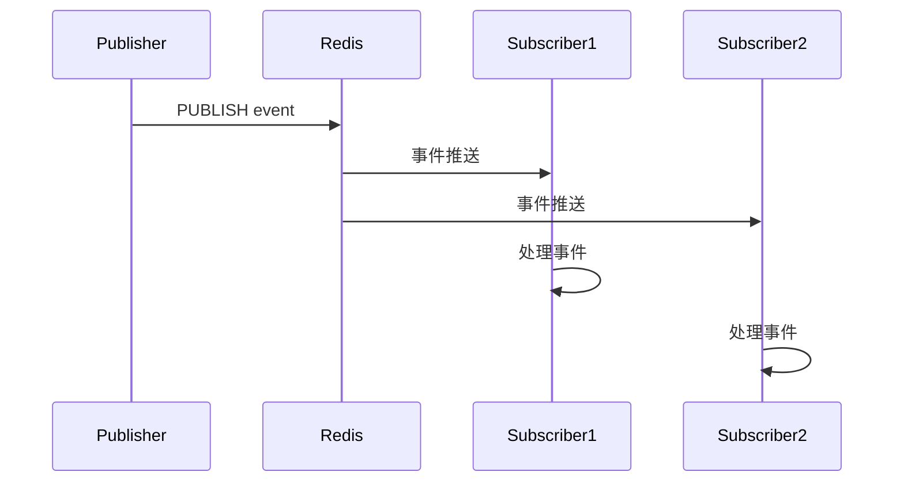
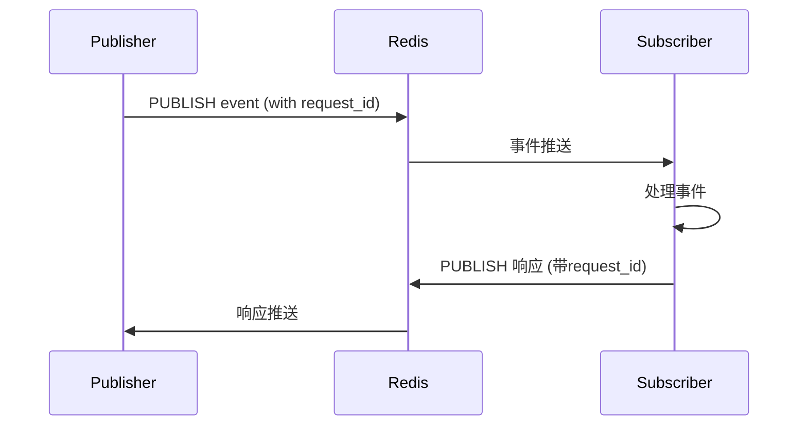

# 事件系统

本项目实现了一个基于Redis的跨服务事件发布-订阅系统，支持三种事件模式：广播模式、请求-响应模式、分组顺序消费模式。

## 事件模式概览

| 模式                 | 适用场景                         | 特点                           | 实现方式                |
|----------------------|----------------------------------|--------------------------------|-------------------------|
| 广播模式             | 通知类事件，无需响应              | 所有订阅者都能收到，无需返回   | Redis Pub/Sub、本地事件 |
| 请求-响应模式        | 需处理结果的事件                  | 点对点，需返回结果，支持超时   | 回调/消息ID+超时机制    |
| 分组顺序消费模式     | 分组隔离、严格顺序、高并发场景    | 每组严格顺序消费，动态注册组   | Redis Stream+动态group  |

---

## 1. 广播模式（Publish/Subscribe）

### 适用场景

- 事件通知、日志、无需响应的消息

### 用法示例

#### Node.js (TypeScript)

```typescript
import { publishEvent } from './events';
publishEvent('user.created', { id: 123, name: '张三' });
```

#### Python

```python
from app.events import publish_event
await publish_event('data.update', {'table': 'users', 'id': 123, 'changes': {'name': '李四'}})
```

### 原理与流程图

- 发布者将事件通过 Redis Pub/Sub 或本地事件系统广播出去
- 所有订阅者都能收到事件并处理，无需响应



### 特点

- 所有订阅者都能收到事件
- 发布者不关心处理结果
- 支持本地和跨服务

---

## 2. 请求-响应模式（Request/Response）

### 适用场景

- 需要处理结果的事件，如AI推理、数据计算等

### 用法示例

#### Node.js (TypeScript)

```typescript
import { publishEventAndWait } from './events';
const result = await publishEventAndWait('ai.request', { requestId: 'req-123', query: '如何使用事件系统？' });
```

#### Python

```python
from app.events import publish_event_and_wait
result = await publish_event_and_wait('calculate.sum', [1, 2, 3, 4, 5])
```

### 原理与流程图

- 发布者发送事件并等待响应，事件带唯一ID
- 订阅者处理事件后返回结果，系统自动路由响应
- 支持超时机制



### 特点

- 发布者等待订阅者处理并返回结果
- 支持超时机制（默认30秒，可自定义）
- 点对点通信

---

## 3. 分组顺序消费模式（Group Stream）

### 适用场景

- 任意需要分组隔离、严格顺序消费的高并发场景（如：每个 group_id/topic 需严格顺序消费）
- 例如：订单、卡片、用户、会话等任意分组下的事件顺序处理

### 用法示例

#### Python

```python
from app.event_system import event_handler

@event_handler('comment')
async def handle_comment_event(data):
    ...

@event_handler('like')
async def handle_like_event(data):
    ...
```

#### Node.js

```typescript
import { eventHandler } from './events';

@event_handler('user.action')
async function handleUserAction(data) {
  ...
}
```

### 原理与流程图

- 发布者将事件写入 Redis Stream（event_stream:{topic}:{group_id}）
- 通过 group_change 频道动态注册/注销 group
- 消费者服务订阅 group_change，动态启动/注销消费协程
- 每个 group_id/topic 只分配一个消费协程，保证严格顺序


### 特点

- 事件分发：根据 topic/group_id 自动分配到对应消费协程
- 顺序保证：每个 group 只分配一个消费协程，系统层面保证顺序
- 并发扩展：不同 group 可并发消费，系统自动管理
- 注册/注销：系统自动感知 group 变动，动态增删消费协程

---

## 配置与超时机制

事件系统直接使用系统中已有的 Redis 实例（如依赖注入或全局对象），无需单独通过环境变量配置 Redis 连接。

### 超时机制

- 请求-响应模式默认超时30秒，可自定义
- 分组顺序消费模式可根据业务需求设置超时

---

## 最佳实践与注意事项

- 推荐统一用装饰器注册消费函数，业务开发者无需关心底层实现
- 事件命名建议：小写+点分隔，如 `user.created`、`ai.request`
- 复杂业务建议使用分组顺序消费模式，保证顺序与隔离

---

如需更详细的实现方案，请参考源码或联系维护者。
