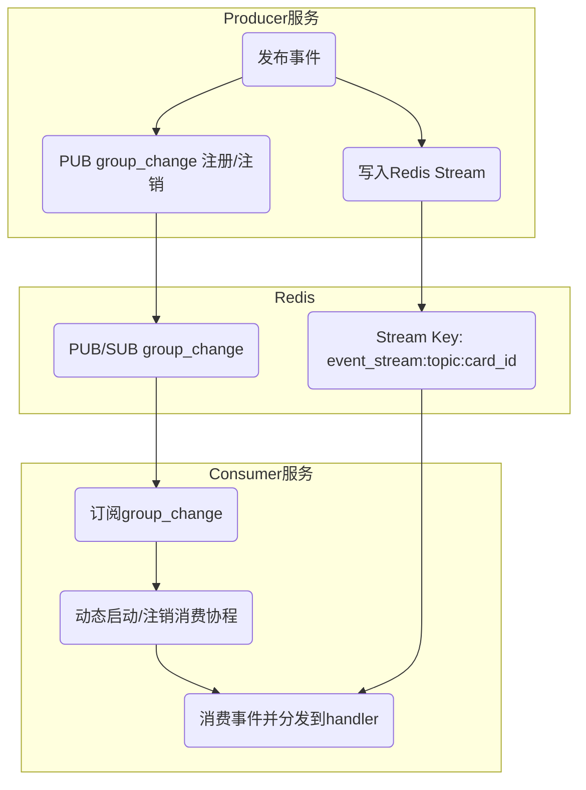
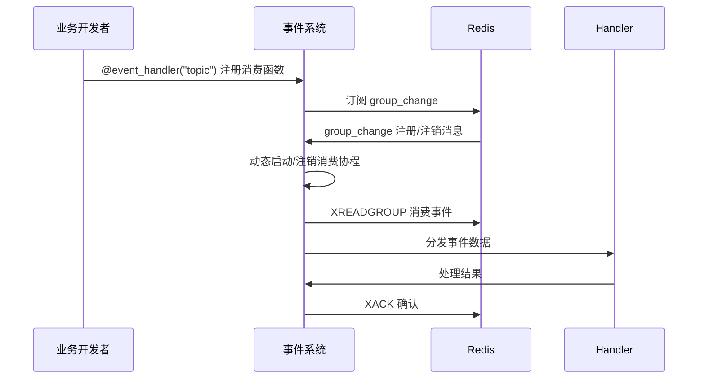
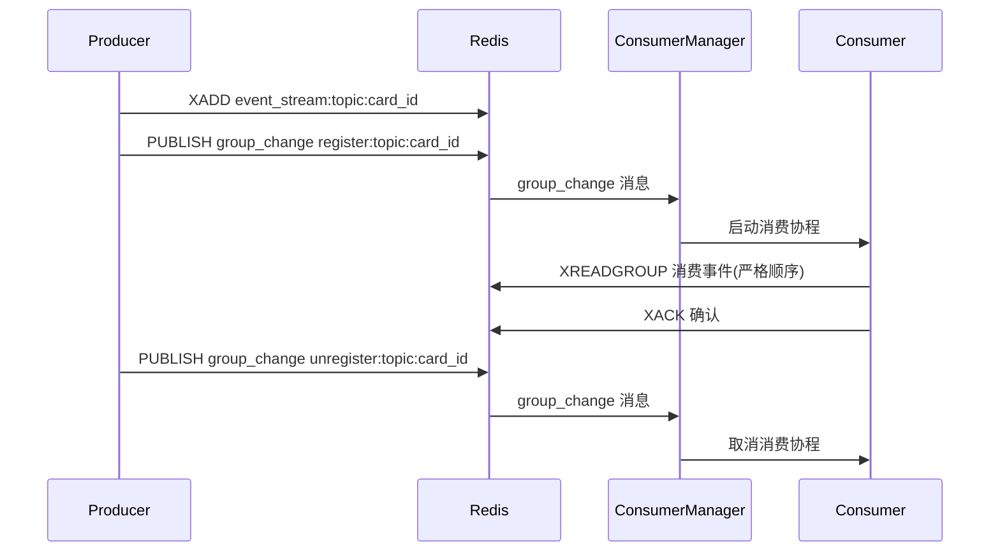

# 事件系统

本项目实现了一个基于Redis的跨服务事件发布-订阅系统，支持两种模式：广播模式和请求-响应模式。

## 特性

- **支持两种事件模式**：
  - 广播模式：发布者不关心结果，任何订阅者都可以接收并处理
  - 请求-响应模式：发布者等待订阅者处理并返回结果
- **本地优先原则**：同一服务内优先使用本地事件机制，提高效率
- **服务隔离**：发布者和订阅者互不感知，降低耦合
- **消息超时**：自动处理消息超时，防止无限等待
- **跨语言支持**：同时支持Node.js和Python服务

## 使用方法

### Node.js (TypeScript)

```typescript
// 发布事件（广播模式）
import { publishEvent } from './events';

publishEvent('user.created', { 
  id: 123, 
  name: '张三' 
});

// 发布事件并等待结果（请求-响应模式）
import { publishEventAndWait } from './events';

try {
  const result = await publishEventAndWait('ai.request', {
    requestId: 'req-123',
    query: '如何使用事件系统？'
  });
  console.log('处理结果:', result);
} catch (error) {
  console.error('处理失败:', error);
}

// 订阅事件（装饰器注册，示例）
import { eventHandler } from './events';

@eventHandler('user.action')
async function handleUserAction(data) {
  console.log('收到用户行为事件:', data);
  // 处理逻辑...
  return { status: 'processed' };
}
```

### Python

```python
# 发布事件（广播模式）
from app.events import publish_event

await publish_event('data.update', {
    'table': 'users',
    'id': 123,
    'changes': {'name': '李四'}
})

# 发布事件并等待结果（请求-响应模式）
from app.events import publish_event_and_wait

try:
    result = await publish_event_and_wait('calculate.sum', [1, 2, 3, 4, 5])
    print(f"计算结果: {result}")
except Exception as e:
    print(f"处理失败: {e}")

# 订阅事件（装饰器注册）
from app.event_system import event_handler

@event_handler('data.process')
async def handle_data_process(data):
    print(f"收到数据处理事件: {data}")
    # 处理逻辑...
    return {'processed': True, 'result': 'success'}
```

## 配置

事件系统依赖Redis进行跨服务通信，需要在环境变量中设置Redis连接URL：

```
REDIS_URL=redis://localhost:6379
```

如果不设置此环境变量，或者不想使用Redis，事件系统将退化为本地事件处理模式。

## 事件超时

默认情况下，请求-响应模式的事件超时时间为30秒，可以在发布事件时自定义：

```typescript
// Node.js
await publishEventAndWait('slow.process', data, { ttl: 60000 }); // 60秒超时

// Python
await publish_event_and_wait('slow.process', data, ttl=60.0) # 60秒超时
```

---

# Redis Stream 动态分组与 Topic 事件系统设计（统一注册方式）

## 设计目标

- 支持大规模动态分组（如每个 cardID 为一组）
- 每组下可有多个 topic，且每个 topic 事件需严格顺序消费
- 支持多语言（Node.js、Python）服务间协作
- 动态注册/注销 group，资源高效利用
- 毫秒级 group 变动感知
- **统一的消费函数注册方式，业务开发者无需关心底层实现**

## 消费者注册方式

### 推荐模式：装饰器注册

- 业务开发者只需用装饰器声明自己要处理的事件（topic），无需关心事件系统底层实现。
- 事件系统自动完成 handler 的注册、分发、顺序/并发控制。

#### Python 示例

```python
from app.event_system import event_handler

@event_handler("comment")
async def handle_comment_event(data):
    ...

@event_handler("like")
async def handle_like_event(data):
    ...
```

#### Node.js 示例

```typescript
import { eventHandler } from './events';

@eventHandler('user.action')
async function handleUserAction(data) {
  ...
}
```

#### 装饰器实现思路

- 装饰器将 handler 注册到全局注册表（如 `EVENT_HANDLERS` 字典）
- 事件系统内部根据 topic 自动路由到对应 handler
- handler 只需处理数据，不关心事件分组、顺序等

## 系统层面职责

- **事件分发**：根据 topic/card_id 自动分配到对应消费协程
- **顺序保证**：每个 group（topic+card_id）只分配一个消费协程，系统层面保证顺序
- **并发扩展**：不同 group 可并发消费，系统自动管理
- **注册/注销**：系统自动感知 group 变动，动态增删消费协程

## 关键接口定义（Python 伪代码）

```python
# 注册表
EVENT_HANDLERS = {}

def event_handler(topic):
    def decorator(func):
        EVENT_HANDLERS[topic] = func
        return func
    return decorator

# 系统内部消费调度
async def consume_stream(redis, topic, card_id, consumer_name):
    handler = EVENT_HANDLERS[topic]
    # ...顺序消费逻辑...
    while True:
        # 读取事件
        # ...
        await handler(event_data)
```

## 典型流程图

### 1. 整体架构流程图



### 2. 消费者注册与事件处理流程



### 3. 事件顺序消费保证



## 适用场景

- 需要动态分组、严格顺序消费的业务场景
- 多 topic 路由不同处理逻辑
- 需毫秒级 group 变动感知

---

如需更详细的实现方案，请参考源码或联系维护者。
