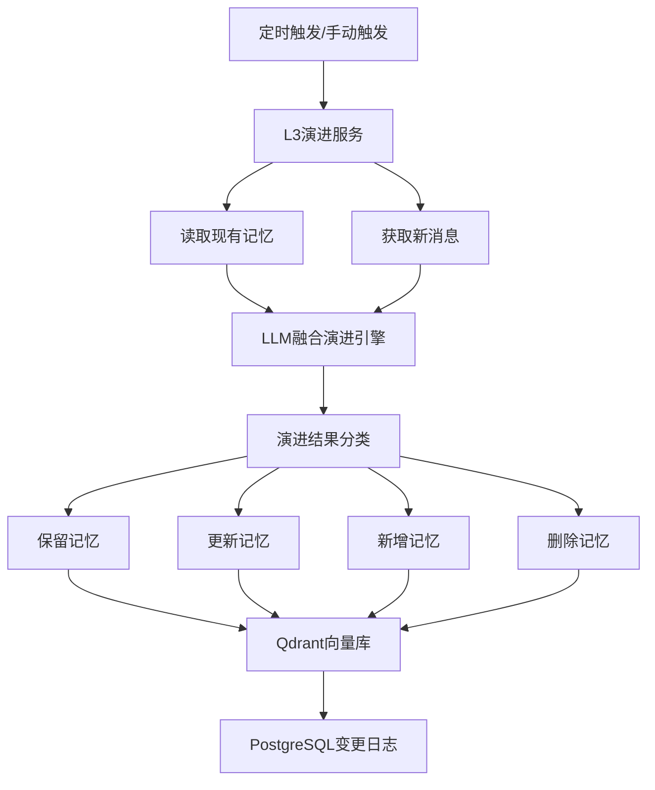
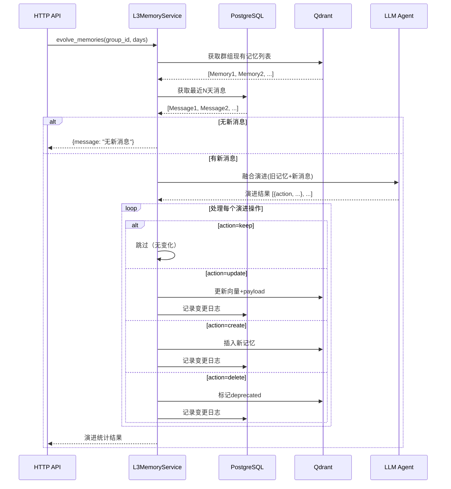

# L3群组记忆融合演进技术方案

## 📋 文档信息

- **版本**: v1.0
- **创建时间**: 2025-01-21
- **状态**: 设计阶段
- **核心概念**: 融合演进式群组长期记忆管理

---

## 🎯 方案概述

### 核心理念

> **旧记忆 + 新讨论 → LLM融合 → 演进后的新记忆**
> 
> 类似Git版本控制，每次演进都是基于上一个状态的智能迭代

L3群组记忆是基于群组历史对话，通过LLM持续提炼和演进的长期稳定记忆。与L1(原始消息)、L2(话题记忆)不同，L3是高度浓缩的、经过验证的群组特征和观点集合。

### 设计目标

1. **智能融合**: 旧记忆与新讨论自然融合，而非简单堆积
2. **持续演进**: 记忆会随群组发展自动更新、强化或淘汰
3. **版本追溯**: 支持查看记忆的演进历史
4. **语义检索**: 基于向量搜索快速定位相关记忆

---

## 🏗️ 系统架构



---

## 💾 数据结构设计

### 1. Qdrant Collection: `group_memories`

**Collection配置:**
```python
{
    "collection_name": "group_memories",
    "vector_size": 1536,  # text-embedding-3-small
    "distance": "Cosine"
}
```

**Point Payload Schema:**
```python
{
    "memory_id": "uuid-v4",           # 记忆唯一ID
    "group_id": "group_xxx",          # 群组ID
    "statement": "具体记忆内容",       # 记忆陈述
    "version": 5,                     # 演进版本号
    "created_at": "2025-01-01T00:00:00Z",
    "updated_at": "2025-01-15T12:30:00Z",
    "parent_id": "uuid-v3",           # 上一版本ID（null表示初始版本）
    "change_summary": "变更说明",     # 本次变更原因
    "status": "active",               # active | deprecated
    "tags": ["习惯", "观点"],         # 可选：记忆分类标签
    "strength": 0.85                  # 可选：记忆强度(0-1)
}
```

### 2. PostgreSQL Table: `memory_change_log` (可选)

如需详细追溯，可在PostgreSQL中记录变更日志：

```sql
CREATE TABLE memory_change_log (
    id SERIAL PRIMARY KEY,
    memory_id UUID NOT NULL,
    group_id VARCHAR(255) NOT NULL,
    action VARCHAR(20) NOT NULL,  -- keep|update|create|delete
    old_statement TEXT,
    new_statement TEXT,
    change_summary TEXT,
    version INTEGER NOT NULL,
    created_at TIMESTAMP DEFAULT NOW(),
    INDEX idx_memory_id (memory_id),
    INDEX idx_group_id (group_id)
);
```

---

## 🔄 核心演进流程

### 完整流程图



### 演进算法伪代码

```python
async def evolve_memories(group_id: str, days: int = 1) -> EvolutionResult:
    """
    融合演进群组记忆
    
    Args:
        group_id: 群组ID
        days: 获取最近N天的消息
        
    Returns:
        EvolutionResult: 演进统计结果
    """
    # Step 1: 获取现有记忆
    existing_memories = await qdrant_service.get_active_memories(group_id)
    
    # Step 2: 获取新消息
    new_messages = await get_recent_messages(group_id, days)
    if not new_messages:
        return EvolutionResult(message="无新消息")
    
    # Step 3: 构建LLM输入
    prompt_context = {
        "existing_memories": format_memories(existing_memories),
        "new_discussions": format_messages(new_messages)
    }
    
    # Step 4: LLM融合演进
    agent = ChatAgent("memory_evolve", tools=[], model_id="gemini-2.5-flash-preview")
    result = await agent.run(messages=[{"role": "user", "content": json.dumps(prompt_context)}])
    
    # Step 4.5: 健壮的JSON解析（使用容错机制）
    evolved_items = parse_evolution_result_robust(result.content)
    
    # Step 5: 应用演进结果
    stats = {"kept": 0, "updated": 0, "created": 0, "deleted": 0, "changes": []}
    
    for item in evolved_items:
        if item.action == "keep":
            stats["kept"] += 1
        elif item.action == "update":
            await update_memory(item)
            stats["updated"] += 1
            stats["changes"].append(item)
        elif item.action == "create":
            await create_memory(item, group_id)
            stats["created"] += 1
            stats["changes"].append(item)
        elif item.action == "delete":
            await deprecate_memory(item.old_id)
            stats["deleted"] += 1
            stats["changes"].append(item)
    
    return EvolutionResult(**stats)


### JSON解析容错处理

由于LLM可能输出格式不完美的JSON，需要实现健壮的解析机制：

```python
def parse_evolution_result_robust(llm_output: str) -> list[EvolutionItem]:
    """
    健壮地解析LLM输出的JSON Lines
    
    容错策略：
    1. 尝试直接解析每行JSON
    2. 如果失败，使用json_repair修复后再解析
    3. 如果仍失败，记录错误并跳过该行
    
    Args:
        llm_output: LLM原始输出文本
        
    Returns:
        成功解析的演进项列表
    """
    from json_repair import repair_json
    import json
    
    items = []
    lines = [line.strip() for line in llm_output.splitlines() if line.strip()]
    
    for i, line in enumerate(lines, 1):
        # 跳过非JSON行（如markdown代码块标记、注释行）
        if line.startswith('```') or line.startswith('#') or line.startswith('//'):
            continue
            
        try:
            # 尝试1: 直接解析
            obj = json.loads(line)
            items.append(EvolutionItem(**obj))
        except json.JSONDecodeError as e:
            try:
                # 尝试2: 使用json_repair修复后解析
                logger.warning(f"第{i}行JSON格式错误，尝试修复: {line[:50]}...")
                repaired = repair_json(line)
                obj = json.loads(repaired)
                items.append(EvolutionItem(**obj))
                logger.info(f"第{i}行JSON修复成功")
            except Exception as repair_error:
                # 尝试3: 实在无法解析，记录详细错误并跳过
                logger.error(
                    f"第{i}行JSON解析最终失败，已跳过 | "
                    f"原始: {line[:100]}... | "
                    f"原始错误: {e} | "
                    f"修复错误: {repair_error}"
                )
                continue
    
    if not items:
        logger.warning("未能解析任何有效的演进项，可能LLM输出格式完全错误")
    else:
        logger.info(f"成功解析 {len(items)}/{len(lines)} 条演进项")
    
    return items
```

**依赖安装:**
```bash
# pyproject.toml 中添加
dependencies = [
    "json-repair>=0.25.0",
    # ... 其他依赖
]
```

**错误处理示例:**

| 场景 | LLM输出 | 处理结果 |
|------|---------|----------|
| 正常JSON | `{"action": "keep", "old_id": "uuid-1"}` | ✅ 直接解析成功 |
| 缺少引号 | `{action: keep, old_id: uuid-1}` | ✅ json_repair修复后成功 |
| 多余逗号 | `{"action": "keep",}` | ✅ json_repair修复后成功 |
| 单引号 | `{'action': 'keep'}` | ✅ json_repair修复后成功 |
| markdown代码块 | <code>```json\n{...}\n```</code> | ✅ 自动跳过标记行 |
| 完全错误 | `这不是JSON` | ⚠️ 记录错误并跳过 |

```

---

## 🤖 Langfuse Prompt设计

### Prompt ID: `memory_evolve`

**系统提示词:**

```
你是一个群组长期记忆管理专家。你的任务是基于现有记忆和最新讨论内容，智能演进群组记忆。

## 什么是群组记忆？
群组记忆是从长期对话中提炼出的稳定特征、习惯、观点和文化。它不是临时话题，而是经过验证的、具有代表性的群组特质。

## 记忆类型示例
- 群组习惯：「每周五晚上讨论新番动漫」
- 共同观点：「大家普遍认为xx作品被低估了」
- 群体特征：「成员主要是技术背景，喜欢深度讨论」
- 文化风格：「对新人友好，鼓励提问」
- 禁忌规则：「不讨论政治话题」

## 你的任务
分析新讨论内容，对现有记忆进行智能演进：

### 演进策略
1. **保留 (keep)**: 新讨论未涉及的记忆，保持不变
2. **更新 (update)**: 新讨论强化/修正/扩展了某个记忆
   - 例如：旧记忆「群组喜欢看动漫」→ 新讨论提到具体偏好 → 更新为「群组偏好看科幻和治愈系动漫」
3. **删除 (delete)**: 新讨论表明某记忆已过时或错误
   - 例如：旧记忆「群组每周讨论新番」→ 新讨论显示已不活跃 → 删除
4. **新增 (create)**: 发现新的稳定特征或观点
   - 注意：必须是稳定的、反复出现的模式，而非一次性讨论

### 输出格式
返回JSON Lines格式（每行一个JSON对象）：

```json
{"action": "keep", "old_id": "uuid-1"}
{"action": "update", "old_id": "uuid-2", "statement": "更新后的记忆内容", "change_reason": "变更原因说明"}
{"action": "delete", "old_id": "uuid-3", "change_reason": "过时原因说明"}
{"action": "create", "statement": "新记忆内容", "change_reason": "为什么这是稳定特征"}
```

### 重要原则
1. **稳定性优先**: 只记录稳定的、反复验证的特征，不是临时讨论
2. **简洁准确**: 表述要简洁、准确、客观，避免冗长
3. **优先更新**: 能更新就不新增，避免冗余记忆
4. **谨慎删除**: 删除要有充分理由，不要轻易删除
5. **保持一致**: 新旧记忆风格和粒度保持一致
```

**用户输入模板:**

```json
{
  "existing_memories": [
    {
      "id": "uuid-1",
      "statement": "群组成员主要是技术背景",
      "version": 3,
      "created_at": "2025-01-01",
      "updated_at": "2025-01-10"
    },
    {
      "id": "uuid-2", 
      "statement": "每周五晚上讨论新番动漫",
      "version": 2,
      "created_at": "2025-01-05",
      "updated_at": "2025-01-12"
    }
  ],
  "new_discussions": [
    "User A: 这周的新番《xxx》怎么样？",
    "User B: 还不错，画质很棒",
    "User A: 我们下周五继续聊吧",
    "User C: 我是做前端开发的，有没有推荐的技术书？",
    "User D: 我也是前端，可以推荐《xxx》"
  ]
}
```

---

## 🔌 API接口设计

### 路由前缀: `/memory`

#### 1. 触发记忆演进

```
POST /memory/evolve/{group_id}
```

**Query参数:**
- `days` (可选, 默认1): 获取最近N天的消息

**Request Body:** 无

**Response:**
```json
{
  "success": true,
  "group_id": "group_xxx",
  "evolution_time": "2025-01-15T12:30:00Z",
  "stats": {
    "kept": 3,
    "updated": 2,
    "created": 1,
    "deleted": 0
  },
  "changes": [
    {
      "action": "update",
      "old_id": "uuid-2",
      "new_id": "uuid-5",
      "old_statement": "每周五晚上讨论新番动漫",
      "new_statement": "每周五晚上讨论新番动漫，偏好科幻题材",
      "change_reason": "新讨论明确了偏好类型",
      "version": 3
    },
    {
      "action": "create",
      "new_id": "uuid-6",
      "statement": "成员普遍从事前端开发工作",
      "change_reason": "多次讨论中验证的稳定特征",
      "version": 1
    }
  ]
}
```

---

#### 2. 列出群组记忆

```
GET /memory/list/{group_id}
```

**Query参数:**
- `status` (可选, 默认"active"): active | deprecated | all
- `limit` (可选, 默认20): 返回数量
- `offset` (可选, 默认0): 分页偏移

**Response:**
```json
{
  "success": true,
  "group_id": "group_xxx",
  "total": 5,
  "memories": [
    {
      "memory_id": "uuid-1",
      "statement": "群组成员主要是技术背景",
      "version": 3,
      "created_at": "2025-01-01T00:00:00Z",
      "updated_at": "2025-01-10T12:00:00Z",
      "parent_id": "uuid-0",
      "status": "active",
      "strength": 0.9
    }
  ]
}
```

---

#### 3. 语义搜索记忆

```
GET /memory/search/{group_id}
```

**Query参数:**
- `q` (必需): 搜索查询文本
- `limit` (可选, 默认5): 返回数量
- `threshold` (可选, 默认0.7): 相似度阈值

**Response:**
```json
{
  "success": true,
  "query": "群组的技术背景",
  "results": [
    {
      "memory_id": "uuid-1",
      "statement": "群组成员主要是前端开发背景",
      "score": 0.92,
      "version": 3,
      "updated_at": "2025-01-10T12:00:00Z"
    }
  ]
}
```

---

#### 4. 查看记忆演进历史

```
GET /memory/history/{memory_id}
```

**Response:**
```json
{
  "success": true,
  "memory_id": "uuid-5",
  "current_version": 3,
  "history": [
    {
      "version": 1,
      "memory_id": "uuid-3",
      "statement": "群组讨论动漫",
      "created_at": "2025-01-01T00:00:00Z",
      "parent_id": null
    },
    {
      "version": 2,
      "memory_id": "uuid-4",
      "statement": "每周五晚上讨论新番动漫",
      "updated_at": "2025-01-05T10:00:00Z",
      "parent_id": "uuid-3",
      "change_summary": "明确了时间规律"
    },
    {
      "version": 3,
      "memory_id": "uuid-5",
      "statement": "每周五晚上讨论新番动漫，偏好科幻题材",
      "updated_at": "2025-01-15T12:30:00Z",
      "parent_id": "uuid-4",
      "change_summary": "新讨论明确了偏好类型"
    }
  ]
}
```

---

#### 5. 查看最近变更

```
GET /memory/changes/{group_id}
```

**Query参数:**
- `days` (可选, 默认7): 查看最近N天的变更

**Response:**
```json
{
  "success": true,
  "group_id": "group_xxx",
  "period": "2025-01-08 to 2025-01-15",
  "changes": [
    {
      "timestamp": "2025-01-15T12:30:00Z",
      "action": "update",
      "memory_id": "uuid-5",
      "old_statement": "每周五晚上讨论新番动漫",
      "new_statement": "每周五晚上讨论新番动漫，偏好科幻题材",
      "change_reason": "新讨论明确了偏好类型"
    }
  ]
}
```

---

#### 6. 手动管理接口（可选）

```
DELETE /memory/{memory_id}  # 删除指定记忆
PUT /memory/{memory_id}/restore  # 恢复已删除记忆
PUT /memory/{memory_id}/strength  # 手动调整记忆强度
```

---

## 📊 核心函数实现

### 文件结构

```
ai-service/app/memory/
├── l3_memory_service.py       # 核心服务（重命名自l3_consensus_service.py）
├── l3_memory_models.py        # 数据模型定义
└── l3_memory_api.py           # API路由（新增）
```

### 核心函数签名

```python
# l3_memory_service.py

async def evolve_memories(
    group_id: str, 
    days: int = 1
) -> EvolutionResult:
    """触发群组记忆演进"""
    pass

async def get_active_memories(
    group_id: str, 
    limit: int = 100
) -> list[Memory]:
    """获取群组活跃记忆列表"""
    pass

async def search_memories(
    group_id: str, 
    query: str, 
    limit: int = 5,
    threshold: float = 0.7
) -> list[MemorySearchResult]:
    """语义搜索记忆"""
    pass

async def get_memory_history(
    memory_id: str
) -> MemoryHistory:
    """获取记忆演进历史"""
    pass

async def update_memory(
    old_id: str,
    new_statement: str,
    change_reason: str,
    group_id: str
) -> Memory:
    """更新记忆（创建新版本）"""
    pass

async def create_memory(
    group_id: str,
    statement: str,
    reason: str
) -> Memory:
    """创建新记忆"""
    pass

async def deprecate_memory(
    memory_id: str,
    reason: str
) -> bool:
    """标记记忆为deprecated"""
    pass
```

---

## 🔧 实施步骤

### Phase 1: 核心功能实现 (优先)

1. **重命名和重构现有代码**
   - [x] 将 `l3_consensus_service.py` 重命名为 `l3_memory_service.py`
   - [ ] 将所有 "consensus" 相关命名改为 "memory"
   - [ ] 将Qdrant collection名从 "consensus" 改为 "group_memories"

2. **实现核心演进逻辑**
   - [ ] 实现 `evolve_memories()` 函数
   - [ ] 实现 `get_active_memories()` 函数
   - [ ] 实现 `update_memory()` / `create_memory()` / `deprecate_memory()`

3. **创建API接口**
   - [ ] 新建 `l3_memory_api.py`
   - [ ] 实现 POST `/memory/evolve/{group_id}`
   - [ ] 实现 GET `/memory/list/{group_id}`
   - [ ] 实现 GET `/memory/search/{group_id}`
   - [ ] 在 `api/router.py` 中注册路由

4. **配置Langfuse Prompt**
   - [ ] 在Langfuse后台创建 `memory_evolve` prompt
   - [ ] 测试prompt效果并调优

### Phase 2: 增强功能 (次要)

5. **实现历史追溯**
   - [ ] 创建PostgreSQL表 `memory_change_log`
   - [ ] 实现 `get_memory_history()` 函数
   - [ ] 实现 GET `/memory/history/{memory_id}`
   - [ ] 实现 GET `/memory/changes/{group_id}`

6. **定时任务集成**
   - [ ] 更新 `worker.py` 中的定时任务
   - [ ] 重命名 `cron_daily_consensus` 为 `cron_daily_memory_evolve`
   - [ ] 启用定时任务（可选）

### Phase 3: 优化和监控 (可选)

7. **性能优化**
   - [ ] 添加缓存层（Redis）
   - [ ] 批量操作优化
   - [ ] 异步任务队列优化

8. **监控和日志**
   - [ ] 添加演进统计指标
   - [ ] 添加Sentry错误追踪
   - [ ] 添加演进质量评估

---

## 🧪 测试用例

### 测试场景1: 首次演进（无旧记忆）

**输入:**
- 群组ID: `group_test_001`
- 现有记忆: 空
- 新消息: 30条关于动漫讨论的消息

**期望输出:**
- 提取3-5个初始记忆
- 所有记忆version=1，parent_id=null

---

### 测试场景2: 正常演进（更新+新增）

**输入:**
- 现有记忆: 5条
- 新消息: 强化了2条记忆，新增了1个话题

**期望输出:**
- kept: 3
- updated: 2 (version++, parent_id指向旧版)
- created: 1 (version=1)
- deleted: 0

---

### 测试场景3: 记忆过时（删除）

**输入:**
- 现有记忆: 包含「每周五讨论新番」
- 新消息: 连续3周无相关讨论

**期望输出:**
- deleted: 1
- 状态标记为deprecated

---

### 测试场景4: 语义搜索

**输入:**
- 查询: 「群组的技术背景是什么？」
- 现有记忆: 包含「成员多为前端开发者」

**期望输出:**
- 返回相关记忆，score > 0.8

---

## 📈 性能指标

### 目标指标

| 指标 | 目标值 | 说明 |
|------|--------|------|
| 演进耗时 | < 30秒 | 包含LLM调用 |
| 搜索延迟 | < 500ms | 向量搜索 |
| 记忆数量 | 10-30条/群组 | 避免过多 |
| 演进频率 | 每天1次 | 定时任务 |
| 准确率 | > 85% | 人工评估 |

---

## 🚨 注意事项

### 1. LLM成本控制
- 每次演进会调用1次LLM（输入包含所有旧记忆+新消息）
- 建议：限制旧记忆数量（如最多50条）
- 建议：限制新消息数量（如最近1天，最多200条）

### 2. 数据一致性
- Qdrant更新和PostgreSQL日志记录需要保持一致
- 建议：使用try-finally确保状态同步
- 考虑：实现补偿机制处理部分失败

### 3. 向量库迁移
- 需要将现有 "consensus" collection迁移到 "group_memories"
- 或者：保留旧数据，启用新collection

### 4. 并发控制
- 同一群组的演进操作需要加锁
- 使用Redis分布式锁避免并发冲突

---

## 📚 参考资料

### 相关文档
- [L2话题记忆设计](./l2_topic_memory.md)
- [Qdrant向量数据库](https://qdrant.tech/documentation/)
- [Langfuse Prompt管理](https://langfuse.com/docs/prompts)

### 代码文件
- [`ai-service/app/memory/l3_memory_service.py`](../ai-service/app/memory/l3_memory_service.py)
- [`ai-service/app/services/qdrant.py`](../ai-service/app/services/qdrant.py)
- [`ai-service/app/workers/unified_worker.py`](../ai-service/app/workers/unified_worker.py)

---

## 🔄 版本历史

| 版本 | 日期 | 变更说明 |
|------|------|----------|
| v1.0 | 2025-01-21 | 初始设计方案 |

---

## ✅ 审核状态

- [x] 技术可行性评估
- [x] 命名规范确认（使用"群组记忆"）
- [ ] 实施优先级确认
- [ ] Code Review
- [ ] 上线前测试