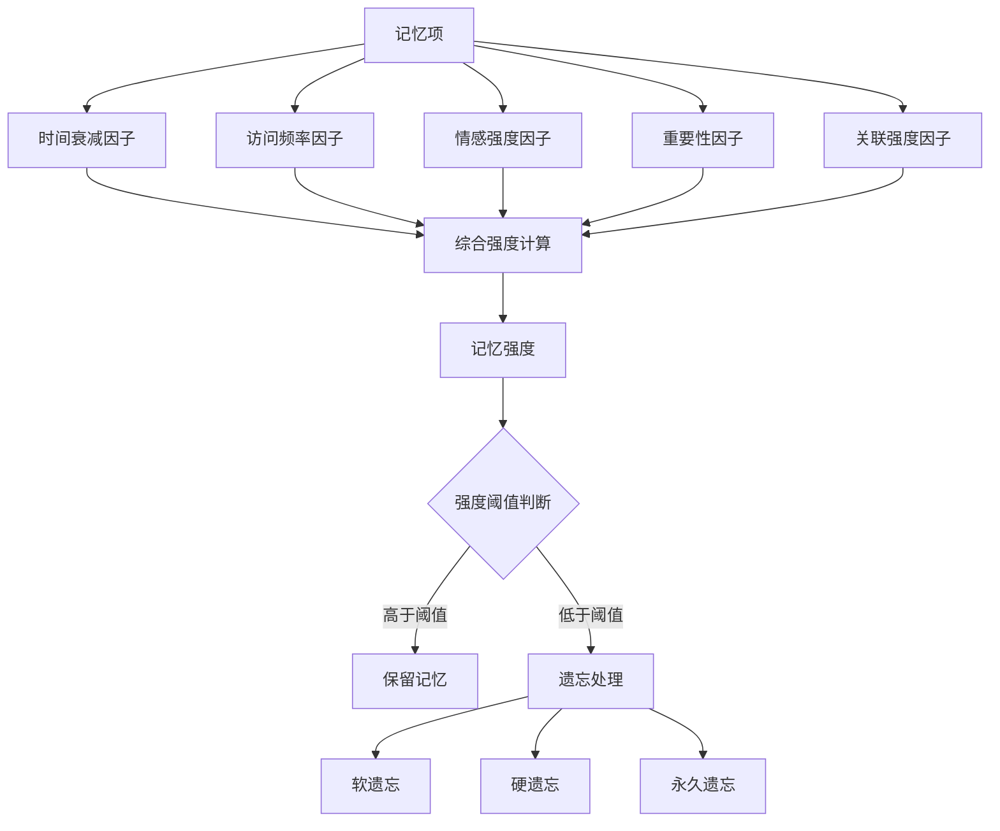
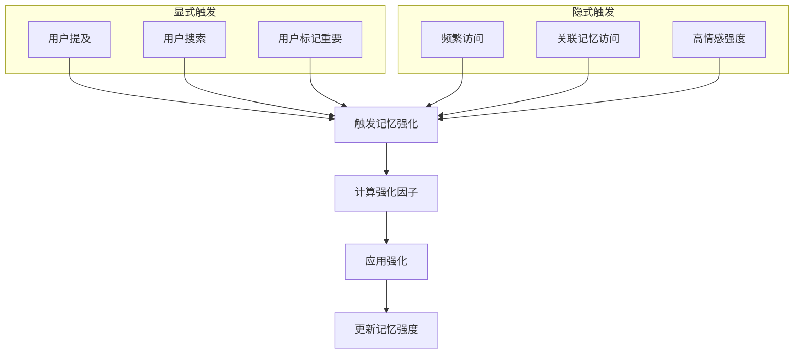
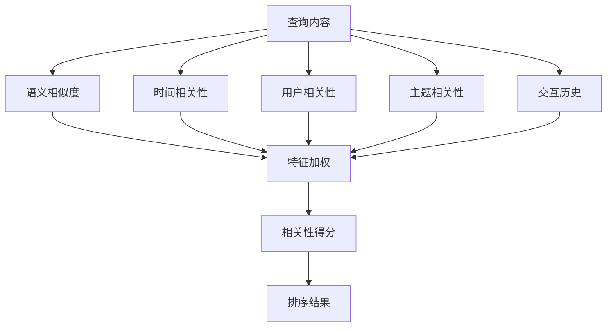
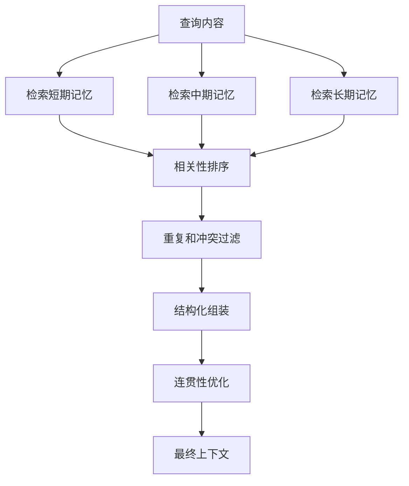
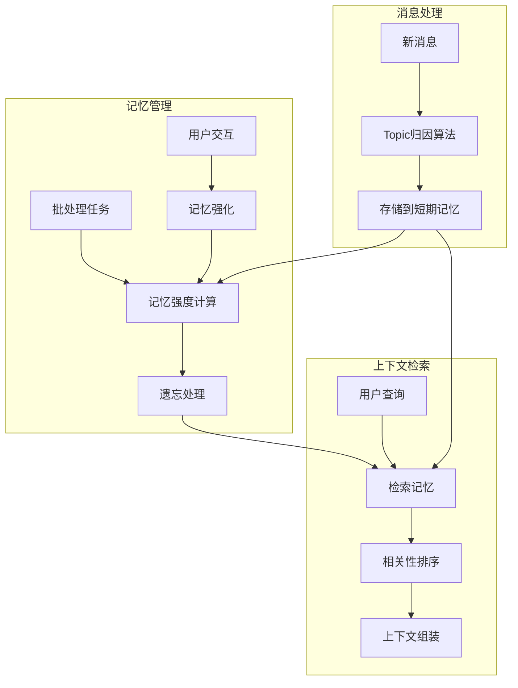

## AI驱动核心算法详细设计

### 1. Topic归因和聚类算法

#### 1.1 算法概述

Topic归因和聚类算法是记忆框架的核心智能组件，负责将新消息实时归类到已有主题或创建新主题，并定期对相似主题进行聚类合并，优化主题结构。该算法采用多维度特征分析和LLM辅助决策，实现高准确度的主题归因。

#### 1.2 实时Topic归因算法

实时Topic归因算法通过多种方式判断消息所属主题：

```mermaid
flowchart TD
    start[新消息] --> reply{有回复关系?}
    reply -->|是| get_topic[获取被回复消息的主题]
    reply -->|否| vector[计算消息向量]
    
    get_topic --> check_topic{主题是否活跃?}
    check_topic -->|是| assign[分配到该主题]
    check_topic -->|否| vector
    
    vector --> similar{找到相似主题?}
    similar -->|是| verify[LLM验证主题相关性]
    similar -->|否| new_topic[创建新主题]
    
    verify -->|相关| assign
    verify -->|不相关| new_topic
    
    assign --> end[返回主题ID]
    new_topic --> end
```

**核心实现代码**：

```python
class TopicClassifier:
    def __init__(self, embedding_service, llm_service, db_client):
        self.embedding_service = embedding_service
        self.llm_service = llm_service
        self.db_client = db_client
        self.similarity_threshold = 0.75  # 相似度阈值
        self.active_topic_timeout = timedelta(hours=24)  # 主题活跃时间窗口
    
    async def classify_message_topic(self, message: Message) -> str:
        """实时主题归因算法"""
        # 1. 检查回复关系
        if message.reply_message_id:
            replied_message = await self.db_client.get_message(message.reply_message_id)
            if replied_message and replied_message.topic_id:
                # 检查主题是否仍活跃
                topic = await self.db_client.get_topic(replied_message.topic_id)
                if topic and self._is_topic_active(topic):
                    return replied_message.topic_id
        
        # 2. 计算消息向量
        message_vector = await self.embedding_service.embed_text(message.content)
        
        # 3. 查找相似主题
        similar_topics = await self._find_similar_topics(
            chat_id=message.chat_id,
            vector=message_vector
        )
        
        # 4. 如果找到相似主题，使用LLM验证相关性
        if similar_topics:
            topic_id = await self._verify_topic_relevance(message, similar_topics)
            if topic_id:
                return topic_id
        
        # 5. 创建新主题
        return await self._create_new_topic(message, message_vector)
    
    async def _find_similar_topics(self, chat_id: str, vector: List[float]) -> List[Topic]:
        """查找相似主题"""
        # 获取活跃的主题
        active_topics = await self.db_client.get_active_topics(
            chat_id=chat_id,
            since=datetime.now() - self.active_topic_timeout
        )
        
        # 计算向量相似度
        similar_topics = []
        for topic in active_topics:
            similarity = self._calculate_cosine_similarity(vector, topic.vector)
            if similarity >= self.similarity_threshold:
                topic.similarity = similarity  # 添加相似度属性
                similar_topics.append(topic)
        
        # 按相似度排序
        similar_topics.sort(key=lambda x: x.similarity, reverse=True)
        return similar_topics[:3]  # 返回最相似的三个主题
    
    async def _verify_topic_relevance(self, message: Message, topics: List[Topic]) -> Optional[str]:
        """使用LLM验证主题相关性"""
        # 获取主题的最近消息
        for topic in topics:
            recent_messages = await self.db_client.get_topic_recent_messages(
                topic_id=topic.topic_id,
                limit=5
            )
            
            # 构建上下文
            context = "\n".join([f"{m.role}: {m.content}" for m in recent_messages])
            
            # LLM判断相关性
            prompt = f"""
            判断以下新消息是否与给定主题相关:
            
            主题: {topic.title}
            主题最近消息:
            {context}
            
            新消息: {message.content}
            
            请仅回答"相关"或"不相关"。
            """
            
            response = await self.llm_service.generate_text(prompt)
            
            if "相关" in response.lower():
                return topic.topic_id
        
        return None
    
    async def _create_new_topic(self, message: Message, vector: List[float]) -> str:
        """创建新主题"""
        # 使用LLM生成主题标题
        title = await self._generate_topic_title(message.content)
        
        # 创建新主题
        topic = Topic(
            topic_id=str(uuid.uuid4()),
            chat_id=message.chat_id,
            title=title,
            description="",
            vector=vector,
            status="active",
            create_time=datetime.now(),
            update_time=datetime.now(),
            metadata={}
        )
        
        # 存储新主题
        await self.db_client.store_topic(topic)
        
        return topic.topic_id
```

#### 1.3 主题聚类算法

主题聚类算法定期对相似主题进行聚类合并，优化主题结构：

```mermaid
flowchart TD
    start[开始聚类] --> get_topics[获取所有主题]
    get_topics --> vectorize[计算主题向量]
    vectorize --> cluster[层次聚类]
    cluster --> evaluate{评估聚类质量}
    evaluate -->|合格| merge[合并相似主题]
    evaluate -->|不合格| adjust[调整聚类参数]
    adjust --> cluster
    merge --> end[结束]
```

**核心实现代码**：

```python
class TopicClusterer:
    def __init__(self, embedding_service, llm_service, db_client):
        self.embedding_service = embedding_service
        self.llm_service = llm_service
        self.db_client = db_client
        self.similarity_threshold = 0.85  # 主题合并阈值
    
    async def cluster_topics(self, chat_id: str) -> Dict:
        """主题聚类算法"""
        # 1. 获取所有主题
        topics = await self.db_client.get_all_topics(chat_id)
        if len(topics) < 2:
            return {"merged": 0, "topics": len(topics)}
        
        # 2. 准备主题向量和元数据
        topic_vectors = []
        topic_data = []
        for topic in topics:
            topic_vectors.append(topic.vector)
            topic_data.append({
                "topic_id": topic.topic_id,
                "title": topic.title,
                "message_count": await self.db_client.get_topic_message_count(topic.topic_id)
            })
        
        # 3. 层次聚类
        clusters = self._hierarchical_clustering(topic_vectors)
        
        # 4. 评估聚类质量
        quality_score = self._evaluate_clustering_quality(clusters, topic_vectors)
        if quality_score < 0.7:  # 质量阈值
            # 调整聚类参数并重试
            clusters = self._hierarchical_clustering(topic_vectors, method='ward')
            quality_score = self._evaluate_clustering_quality(clusters, topic_vectors)
        
        # 5. 合并相似主题
        merged_count = 0
        for cluster in clusters:
            if len(cluster) < 2:
                continue
                
            # 获取聚类中的主题
            cluster_topics = [topic_data[i] for i in cluster]
            
            # 验证主题相似性
            should_merge = await self._verify_cluster_similarity(cluster_topics)
            if should_merge:
                # 选择主题合并目标（通常选择消息最多的主题）
                target_topic = max(cluster_topics, key=lambda x: x["message_count"])
                source_topics = [t for t in cluster_topics if t["topic_id"] != target_topic["topic_id"]]
                
                # 执行合并
                for source in source_topics:
                    await self._merge_topics(source["topic_id"], target_topic["topic_id"])
                    merged_count += 1
        
        return {
            "merged": merged_count,
            "topics": len(topics),
            "quality_score": quality_score
        }
```

#### 1.4 自适应参数调整

为提高算法的适应性，实现了参数自动调整机制：

```python
class AdaptiveParameterAdjuster:
    def __init__(self):
        self.params = {
            "similarity_threshold": 0.75,
            "active_topic_timeout": 24,  # 小时
            "cluster_quality_threshold": 0.7
        }
        self.adjustment_history = []
        
    async def adjust_parameters(self, performance_metrics: Dict) -> Dict:
        """根据性能指标调整参数"""
        # 分析错误类型
        false_positives = performance_metrics.get("false_positives", 0)
        false_negatives = performance_metrics.get("false_negatives", 0)
        
        # 调整相似度阈值
        if false_positives > false_negatives:
            # 过多误归类，提高阈值
            self.params["similarity_threshold"] = min(
                0.95, 
                self.params["similarity_threshold"] + 0.02
            )
        elif false_negatives > false_positives:
            # 过多漏归类，降低阈值
            self.params["similarity_threshold"] = max(
                0.55, 
                self.params["similarity_threshold"] - 0.02
            )
        
        # 记录调整历史
        self.adjustment_history.append({
            "timestamp": datetime.now(),
            "metrics": performance_metrics,
            "new_params": self.params.copy()
        })
        
        return self.params
```

### 2. 记忆遗忘和强化机制

#### 2.1 算法概述

记忆遗忘和强化机制模拟人类记忆的遗忘和强化过程，通过计算记忆强度决定哪些记忆应该被淡化或遗忘，以及如何增强重要或频繁访问的记忆。该机制基于艾宾浩斯遗忘曲线，结合多种因素动态调整记忆强度。

#### 2.2 记忆强度计算模型

记忆强度计算模型考虑多种因素，综合决定记忆的保留强度：



**核心实现代码**：

```python
class MemoryStrengthManager:
    def __init__(self, db_client, embedding_service):
        self.db_client = db_client
        self.embedding_service = embedding_service
        self.soft_forget_threshold = 0.3    # 软遗忘阈值
        self.hard_forget_threshold = 0.1    # 硬遗忘阈值
        self.permanent_forget_threshold = 0.05  # 永久遗忘阈值
        
    async def calculate_memory_strength(self, memory_id: str, memory_type: str) -> float:
        """计算记忆强度"""
        # 获取记忆项
        memory_item = await self._get_memory_item(memory_id, memory_type)
        if not memory_item:
            return 0.0
        
        # 获取记忆强度记录
        strength_record = await self.db_client.get_memory_strength(memory_id, memory_type)
        initial_strength = strength_record.strength if strength_record else 1.0
        last_access = strength_record.last_access if strength_record else memory_item.create_time
        
        # 计算各因素
        time_factor = self._calculate_time_decay(last_access)
        access_factor = await self._calculate_access_factor(memory_id, memory_type)
        emotion_factor = await self._calculate_emotion_factor(memory_item)
        importance_factor = await self._calculate_importance_factor(memory_item)
        relevance_factor = await self._calculate_relevance_factor(memory_id, memory_type)
        
        # 综合计算记忆强度
        new_strength = initial_strength * time_factor * (
            1.0 + 0.2 * access_factor + 0.2 * emotion_factor + 
            0.3 * importance_factor + 0.3 * relevance_factor
        )
        
        # 限制在0-1范围内
        new_strength = max(0.0, min(1.0, new_strength))
        
        # 更新记忆强度记录
        await self._update_strength_record(memory_id, memory_type, new_strength)
        
        return new_strength
    
    def _calculate_time_decay(self, last_access: datetime) -> float:
        """计算基于艾宾浩斯遗忘曲线的时间衰减因子"""
        hours_passed = (datetime.now() - last_access).total_seconds() / 3600
        
        # 艾宾浩斯遗忘曲线: R = e^(-t/S)
        # R是记忆保留率，t是时间，S是相对稳定性参数
        stability = 24.0  # 24小时的稳定性参数
        decay = math.exp(-hours_passed / stability)
        
        return decay
```

#### 2.3 记忆强化触发机制

记忆强化通过显式和隐式两种方式触发：



**核心实现代码**：

```python
class MemoryReinforcementManager:
    def __init__(self, db_client, strength_manager):
        self.db_client = db_client
        self.strength_manager = strength_manager
        
    async def handle_explicit_reinforcement(self, memory_id: str, memory_type: str, 
                                           trigger_type: str, user_id: str) -> float:
        """处理显式记忆强化"""
        # 记录强化事件
        await self.db_client.record_reinforcement_event(
            memory_id, memory_type, trigger_type, user_id
        )
        
        # 计算强化因子
        factor = self._calculate_explicit_factor(trigger_type)
        
        # 应用强化
        new_strength = await self.strength_manager.reinforce_memory(
            memory_id, memory_type, factor
        )
        
        # 强化关联记忆
        await self._reinforce_related_memories(memory_id, memory_type, factor * 0.5)
        
        return new_strength
    
    async def handle_implicit_reinforcement(self, memory_id: str, memory_type: str,
                                          trigger_type: str) -> float:
        """处理隐式记忆强化"""
        # 记录强化事件
        await self.db_client.record_reinforcement_event(
            memory_id, memory_type, trigger_type, None
        )
        
        # 计算强化因子
        factor = self._calculate_implicit_factor(trigger_type)
        
        # 应用强化
        new_strength = await self.strength_manager.reinforce_memory(
            memory_id, memory_type, factor
        )
        
        return new_strength
```

#### 2.4 动态阈值调整

为适应不同场景和用户行为，实现了动态阈值调整机制：

```python
class DynamicThresholdAdjuster:
    def __init__(self, db_client):
        self.db_client = db_client
        self.thresholds = {
            "soft_forget": 0.3,
            "hard_forget": 0.1,
            "permanent_forget": 0.05
        }
        self.adjustment_interval = timedelta(days=7)
        self.last_adjustment = datetime.now()
        
    async def adjust_thresholds(self) -> Dict:
        """动态调整遗忘阈值"""
        # 检查是否到达调整间隔
        if datetime.now() - self.last_adjustment < self.adjustment_interval:
            return self.thresholds
            
        # 获取系统状态指标
        system_metrics = await self._get_system_metrics()
        
        # 根据存储使用情况调整
        storage_adjustment = self._calculate_storage_adjustment(system_metrics)
        
        # 根据用户行为调整
        behavior_adjustment = await self._calculate_behavior_adjustment()
        
        # 应用调整
        self.thresholds["soft_forget"] = max(0.1, min(0.5, 
            self.thresholds["soft_forget"] + storage_adjustment + behavior_adjustment
        ))
        self.thresholds["hard_forget"] = max(0.05, min(0.3, 
            self.thresholds["hard_forget"] + storage_adjustment + behavior_adjustment
        ))
        self.thresholds["permanent_forget"] = max(0.01, min(0.1, 
            self.thresholds["permanent_forget"] + storage_adjustment + behavior_adjustment
        ))
        
        # 更新调整时间
        self.last_adjustment = datetime.now()
        
        # 记录调整历史
        await self.db_client.record_threshold_adjustment(self.thresholds)
        
        return self.thresholds
```

### 3. 相关性排序和上下文组装算法

#### 3.1 算法概述

相关性排序和上下文组装算法负责从三层记忆中检索相关信息，并根据多维度相关性进行排序和组装，生成连贯的上下文。该算法考虑语义相似度、时间相关性、用户相关性等多个特征，实现高质量的记忆检索和上下文组装。

#### 3.2 多特征相关性模型

多特征相关性模型综合考虑多种因素，计算记忆项的相关性得分：



**核心实现代码**：

```python
class RelevanceRanker:
    def __init__(self, embedding_service, db_client):
        self.embedding_service = embedding_service
        self.db_client = db_client
        self.weights = {
            "semantic": 0.4,
            "temporal": 0.2,
            "user": 0.15,
            "topic": 0.15,
            "interaction": 0.1
        }
        
    async def rank_memories(self, query: str, chat_id: str, user_id: str, 
                          memory_items: List[Any], memory_type: str) -> List[Any]:
        """对记忆项进行相关性排序"""
        if not memory_items:
            return []
            
        # 计算查询向量
        query_vector = await self.embedding_service.embed_text(query)
        
        # 获取当前上下文
        context = await self._get_current_context(chat_id)
        
        # 计算各项特征得分
        scores = []
        for item in memory_items:
            # 语义相似度
            semantic_score = await self._calculate_semantic_similarity(item, query_vector)
            
            # 时间相关性
            temporal_score = self._calculate_temporal_relevance(item)
            
            # 用户相关性
            user_score = await self._calculate_user_relevance(item, user_id)
            
            # 主题相关性
            topic_score = await self._calculate_topic_relevance(item, context)
            
            # 交互历史
            interaction_score = await self._calculate_interaction_history(item)
            
            # 综合得分
            total_score = (
                self.weights["semantic"] * semantic_score +
                self.weights["temporal"] * temporal_score +
                self.weights["user"] * user_score +
                self.weights["topic"] * topic_score +
                self.weights["interaction"] * interaction_score
            )
            
            scores.append((item, total_score))
        
        # 按得分排序
        scores.sort(key=lambda x: x[1], reverse=True)
        
        # 返回排序后的记忆项
        return [item for item, _ in scores]
```

#### 3.3 上下文组装算法

上下文组装算法从三层记忆中选择和组合最相关的信息，生成连贯的上下文：



**核心实现代码**：

```python
class ContextAssembler:
    def __init__(self, db_client, embedding_service, llm_service):
        self.db_client = db_client
        self.embedding_service = embedding_service
        self.llm_service = llm_service
        self.relevance_ranker = RelevanceRanker(embedding_service, db_client)
        
    async def assemble_context(self, query: str, chat_id: str, user_id: str, 
                             max_tokens: int = 2000) -> Dict:
        """组装上下文"""
        # 1. 从三层记忆检索候选项
        short_term_items = await self._retrieve_short_term_memories(query, chat_id)
        mid_term_items = await self._retrieve_mid_term_memories(query, chat_id)
        long_term_items = await self._retrieve_long_term_memories(query, user_id)
        
        # 2. 对各层记忆进行相关性排序
        ranked_short_term = await self.relevance_ranker.rank_memories(
            query, chat_id, user_id, short_term_items, "message"
        )
        ranked_mid_term = await self.relevance_ranker.rank_memories(
            query, chat_id, user_id, mid_term_items, "summary"
        )
        ranked_long_term = await self.relevance_ranker.rank_memories(
            query, chat_id, user_id, long_term_items, "knowledge"
        )
        
        # 3. 过滤重复和冲突信息
        filtered_items = await self._filter_duplicates_and_conflicts(
            ranked_short_term, ranked_mid_term, ranked_long_term
        )
        
        # 4. 结构化组装上下文
        structured_context = await self._structure_context(
            filtered_items, query, max_tokens
        )
        
        # 5. 优化上下文连贯性
        optimized_context = await self._optimize_coherence(structured_context, query)
        
        # 6. 记录访问历史
        await self._record_context_access(optimized_context)
        
        return optimized_context
```

### 4. 算法协同工作机制

三个核心算法通过协同工作，共同支撑飞书闲聊记忆框架的智能性：



#### 4.1 数据流转关系

三个算法之间的数据流转关系如下：

1. **Topic归因 → 记忆强度计算**：新消息被归类到主题后，会触发相关主题和消息的记忆强度更新
2. **Topic归因 → 上下文组装**：主题信息被用于提高上下文组装的相关性和连贯性
3. **记忆强度 → 上下文组装**：记忆强度影响记忆项在检索和排序中的权重
4. **上下文组装 → 记忆强化**：用户对检索结果的交互会触发记忆强化

#### 4.2 系统评估指标

为评估算法性能，定义了以下关键指标：

1. **Topic归因准确率**：正确归类的消息比例
2. **主题聚类质量**：聚类的内聚性和分离性
3. **记忆检索准确率**：检索结果的相关性和完整性
4. **上下文连贯性**：生成的上下文的逻辑连贯性
5. **系统响应时间**：算法执行的延迟和吞吐量

#### 4.3 持续优化策略

为确保算法持续优化，采用以下策略：

1. **A/B测试**：对算法参数和策略进行对比实验
2. **用户反馈学习**：根据用户反馈调整算法行为
3. **自动参数调优**：根据系统性能指标自动调整参数
4. **模型迭代更新**：定期更新底层AI模型以提升性能

### 5. 实施路径

#### 5.1 分阶段实施

建议采用分阶段实施策略：

1. **基础版**：实现基本的Topic归因和简单的记忆检索
2. **标准版**：加入记忆强度计算和基本的上下文组装
3. **高级版**：实现完整的三个核心算法和协同工作机制
4. **智能版**：加入自适应参数调整和持续优化策略

#### 5.2 技术挑战及解决方案

实施过程中可能面临的技术挑战及解决方案：

1. **实时性挑战**：
   - 挑战：Topic归因需要在毫秒级完成
   - 解决方案：采用缓存策略和异步处理，优先使用回复链和关键词匹配，只在必要时调用向量检索和LLM

2. **准确性挑战**：
   - 挑战：确保Topic归因和记忆检索的准确性
   - 解决方案：多特征融合、LLM辅助决策、用户反馈学习

3. **计算资源挑战**：
   - 挑战：LLM调用和向量计算资源消耗大
   - 解决方案：批处理优化、模型量化、结果缓存

4. **冷启动挑战**：
   - 挑战：新用户或新会话缺乏历史数据
   - 解决方案：默认参数策略、快速适应机制、通用知识补充