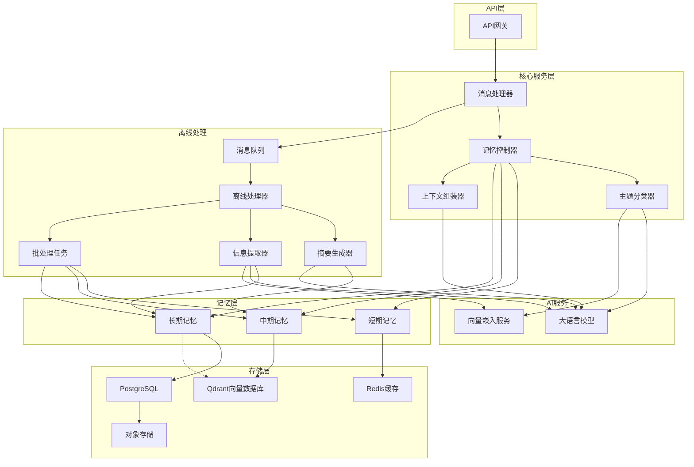
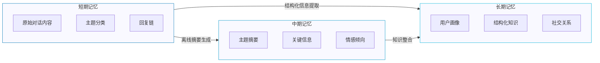
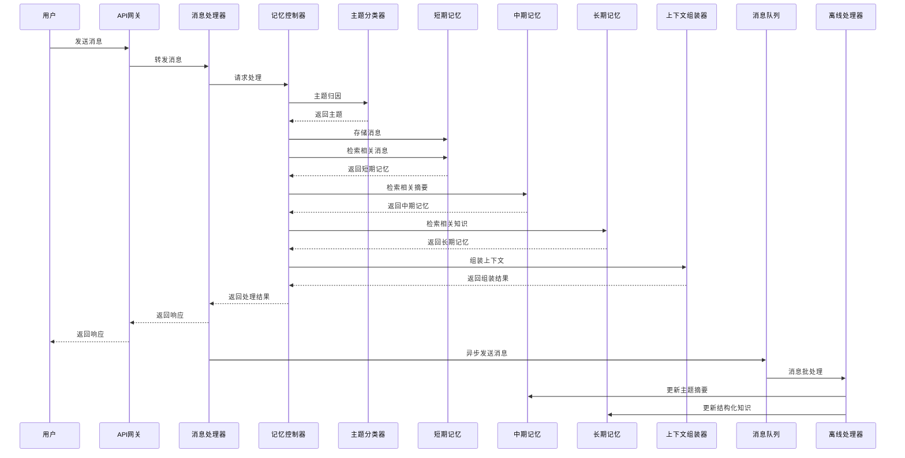
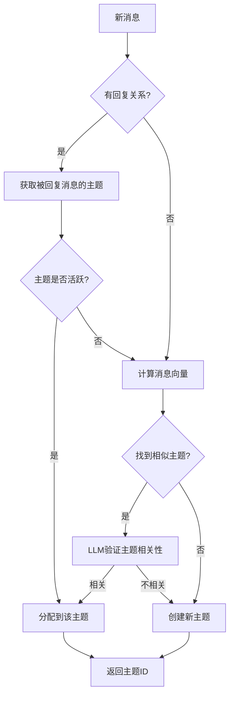

# 飞书闲聊记忆框架核心架构设计

## 1. 设计背景与目标

### 1.1 系统定位

飞书闲聊记忆框架是为上层LLM聊天机器人设计的支持系统，负责记住用户闲聊内容和机器人自身回答。系统默认使用快速检索获取上下文，而深度搜索作为tools提供给大模型使用。作为支持系统，该框架不直接与用户交互，不包含直接的用户反馈机制。

### 1.2 场景特点

飞书闲聊场景具有以下特点：

- 对话频繁且多样化，包括短对话和多轮深度对话
- 跨会话记忆需求强烈，用户期望AI助手能"记住"过去的交流
- 企业级应用场景，对安全性和隐私保护要求高
- 多用户交互环境，需处理群组和私聊两种模式

### 1.3 核心目标

记忆框架的核心目标是：

- 提供个性化、连贯的对话体验
- 实现高效的记忆存储、检索和管理
- 确保系统可扩展性和性能
- 保障数据安全和用户隐私

## 2. 系统整体架构

系统采用分层架构设计，包括API层、核心服务层、记忆层和存储层，并由离线处理和AI服务提供支持。



## 3. 三层记忆模型

记忆框架采用三层记忆模型，模拟人类记忆机制，平衡性能和记忆深度。



**短期记忆**：存储最近的原始对话内容，使用Redis缓存实现高速访问，主要服务于实时对话上下文。

**中期记忆**：存储主题摘要和关键知识点，使用Qdrant向量数据库实现语义检索，服务于跨会话的主题连贯性。

**长期记忆**：存储结构化的知识和用户画像，结构化数据使用PostgreSQL实现复杂查询，向量数据使用Qdrant实现语义检索，服务于个性化交互和深度问答。

## 4. 核心数据流

系统包含两条主要数据流：实时处理流程和离线处理流程。



**实时处理流程**：
1. 接收用户消息并进行主题归因
2. 存储消息到短期记忆
3. 从三层记忆检索相关信息
4. 组装上下文并返回响应

**离线处理流程**：
1. 消息异步发送到队列
2. 批量处理消息生成摘要
3. 提取结构化信息更新长期记忆
4. 执行记忆管理任务（如遗忘、强化）

## 5. 核心组件功能

系统由以下核心组件组成：

| 组件名称 | 主要职责 | 关键技术 |
|---------|---------|---------|
| **API网关** | 统一接口管理、请求路由、权限验证 | FastAPI、JWT认证 |
| **消息处理器** | 消息解析、任务分发、响应生成 | 异步处理、事件驱动 |
| **记忆控制器** | 协调三层记忆、决策记忆操作 | 状态管理、策略模式 |
| **主题分类器** | 消息主题归因、主题创建与合并 | 向量相似度、LLM辅助决策 |
| **上下文组装器** | 构建连贯上下文、信息排序 | 多特征排序、模板填充 |
| **离线处理器** | 调度离线任务、资源管理 | 任务队列、工作池 |
| **摘要生成器** | 生成主题摘要、提取关键信息 | 多模型融合、质量评估 |
| **信息提取器** | 识别实体关系、构建知识图谱 | NER、关系抽取、知识融合 |

## 6. AI驱动核心算法

系统的智能性主要由三个AI驱动的核心算法提供：

**Topic归因和聚类算法**：实时将新消息归类到已有主题或创建新主题，并定期对相似主题进行聚类合并。



**记忆遗忘和强化机制**：基于艾宾浩斯遗忘曲线和多因素记忆强度计算，决定记忆的保留、淡化或遗忘。

**相关性排序和上下文组装算法**：从三层记忆中检索信息，并根据多维度相关性进行排序和组装，生成连贯的上下文。

## 7. 接口设计

系统对外提供两类核心接口：

**消息异步写入接口**：

```python
@app.post("/api/v1/memory/message")
async def store_message(message: ChatMessage, background_tasks: BackgroundTasks):
    """
    异步存储消息并触发记忆处理
    """
    # 立即响应，后台处理
    background_tasks.add_task(process_message, message)
    return {"status": "success", "message_id": message.message_id}
```

**多级检索接口**：

```python
@app.post("/api/v1/memory/quick_search")
async def quick_search(request: MemorySearchRequest):
    """
    快速检索：返回同主题的原始上下文和关键知识
    """
    # 从短期记忆和长期记忆中快速检索
    context = await memory_controller.quick_search(
        chat_id=request.chat_id,
        query=request.query,
        limit=request.limit
    )
    return {"context": context}

@app.post("/api/v1/memory/topic_search")
async def topic_search(request: TopicSearchRequest):
    """
    特定主题检索：通过自然语言进行深度检索
    """
    # 从中期记忆和长期记忆中进行深度检索
    context = await memory_controller.topic_search(
        chat_id=request.chat_id,
        query=request.query,
        search_type=request.search_type,
        params=request.params
    )
    return {"context": context}
```

## 8. 系统扩展性与性能

**扩展性设计**：

- 模块化架构：各组件松耦合，可独立扩展
- 微服务设计：核心服务可独立部署和扩展
- 存储层分离：不同类型记忆使用适合的存储方案

**性能优化**：

- 多级缓存策略：热点数据缓存，减少数据库访问
- 异步处理：非关键路径使用异步任务
- 批处理优化：定期批量处理，减少资源消耗
- 索引优化：针对常见查询模式优化索引

## 9. 实施路径

建议采用分阶段实施策略：

1. **基础架构搭建**：实现核心服务和存储，支持基本的短期记忆
2. **核心功能实现**：开发三层记忆模型和核心算法
3. **高级功能和优化**：实现离线处理流程和性能优化
4. **扩展和集成**：支持更多场景和功能扩展
