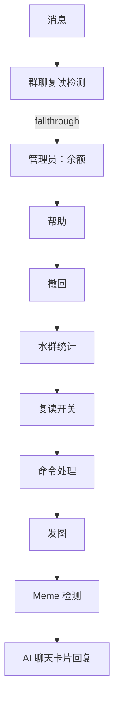

# Message Processing (消息处理)

负责对接收到的消息进行解析、匹配与响应，结合规则引擎与 AI 服务产出结果。以“规则链”组织复杂逻辑，并按需调用媒体/管理等处理器。

## 目录结构

```
core/rules/
├── engine.ts        # 规则引擎（同步/异步规则、fallthrough）
├── rule.ts          # 通用规则定义（OnlyGroup/NeedRobotMention 等）
├── admin/           # 管理员规则（余额、撤回、命令）
├── general/         # 通用规则（水群统计、帮助）
└── group/           # 群聊规则（复读开关与复读）
```

## 规则链（Mermaid）



## 写法约定

- 规则划分：轻量同步校验放入 `rules`；涉及外部依赖的校验放入 `async_rules`
- fallthrough：仅在需要并行命中多个功能时开启，避免重复回复
- 错误兜底：处理器内部统一 try/catch，并向用户回传友好错误信息
- 权限检查：`IsAdmin`、白名单群检查等作为前置规则

## 扩展指南

1. 在对应子目录新增规则文件与处理器
2. 在 `engine.ts` 的规则集数组中追加一项，配置 `rules/async_rules/handler/fallthrough`
3. 如需 AI 能力，调用 `core/services/ai` 的 sseChat，并按需保存消息到 Memory 服务
