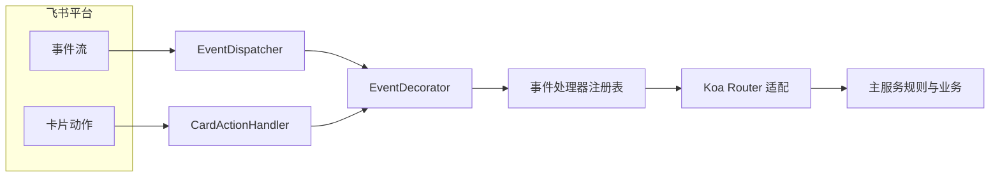

# Integrations (外部服务集成)

本模块负责与所有第三方服务进行集成，提供统一的适配与上下文透传能力。

## 目录结构

```
integrations/
├── aliyun/        # 阿里云 OSS/代理
├── lark/          # 飞书 OpenAPI/WS、事件注册与路由适配
├── memory.ts      # 记忆服务客户端
├── lark-client.ts # Lark 客户端池初始化
└── README.md
```

## 事件流（Mermaid）



## 能力说明

- 事件适配：按 HTTP/WS 两种模式注册并分发事件，卡片事件单独适配
- 上下文透传：通过装饰器注入 traceId/botName，统一到中间件 context
- 客户端池：统一初始化与管理 Lark 客户端，提供复用与统一日志级别

## 添加新的集成

1. 在 `integrations` 目录下创建子目录并实现客户端或代理
2. 通过服务层调用该集成，配合中间件传递上下文（X-Trace-Id/ X-App-Name）
3. 如需事件处理，注册到 EventRegistry 并适配到 Koa Router
