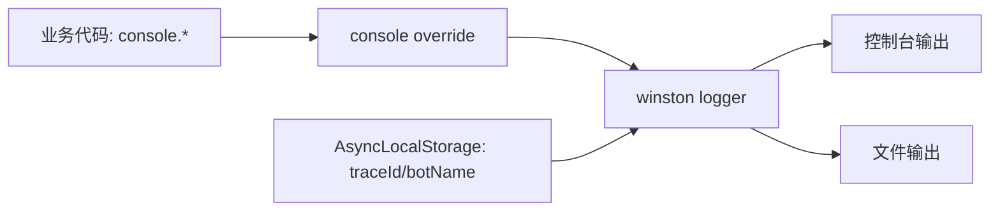

# 日志模块（Logger）

本模块基于 winston 封装统一的日志能力，并提供“可选的 console 覆盖”机制，保持现有代码中的 `console.log/console.error` 等调用无需改动即可接入结构化日志与文件落盘。

## 为什么不需要把 console.log 替换成 logger.info

- 已有“控制台重写”（console override）机制：在启用文件日志时，可自动将 `console.log/info/warn/error` 代理到 winston 的对应级别，并注入 traceId。
- 迁移成本低：不强制要求在业务代码里把所有 `console.*` 改成 `logger.*`，避免大规模无意义改动。
- 统一格式输出：即便使用 `console.*`，也能在控制台/文件中按统一格式输出，并包含上下文（traceId）。

## 目录结构

```
infrastructure/logger/
├── index.ts   # LoggerFactory/TransportFactory 与 console override
└── README.md
```

## 工作原理（Mermaid）



- 未启用文件日志时：默认仅控制台输出，带颜色与简单格式。
- 启用文件日志时：可选开启“控制台重写”，统一由 winston 处理控制台与文件输出。

## 配置说明（环境变量）

- `LOG_LEVEL`：日志级别（默认 `info`）
- `ENABLE_FILE_LOGGING`：是否开启文件日志（`true`/`false`）
- `LOG_DIR`：文件日志目录（默认 `/var/log/main-server`）
- 内部默认：文件名 `app.log`、单文件最大 5MB、最多保留 5 个文件
- `enableConsoleOverride`：代码中默认为 `true`，仅当开启文件日志时才进行 console 覆盖

## 使用方式

- 直接使用现有的 `console.*` 即可；当启用文件日志时会自动代理到 winston：

```typescript
// 业务代码中：
console.log('启动完成');
console.error(new Error('不可恢复错误'));
```

- 如需手动 logger：

```typescript
import logger from '@infrastructure/logger';

logger.info('手动日志');
logger.error('错误日志', { code: 'E_BAD' });
```

## 设计细节

- ConsoleTransport：彩色输出 + 简洁格式；带 traceId 后缀（从 AsyncLocalStorage 读取）
- FileTransport：JSON 化结构输出，包含时间戳与 traceId，便于日志收集与检索
- Console Override：将 `console.log/info/warn/error` 重写为对应级别的 winston 调用，并注入 traceId；对象自动 JSON 序列化

## 最佳实践

- 不建议在全局强制替换业务代码的 `console.*` 为 `logger.*`：交由 override 统一处理即可
- 在关键路径（如错误处理、外部调用失败）可使用 `logger.error` 提供结构化字段，便于检索与告警
- 确保 `traceMiddleware` 在 Koa 中靠前执行，以便日志中包含正确的 traceId
- 文件日志目录需可写；容器环境中建议挂载日志目录或使用标准输出结合采集

## 常见问题

- 为什么控制台和文件格式不同？控制台偏人读、文件偏机读（JSON），便于后续 ELK/Logstash 收集
- 是否总是覆盖 console？仅在开启文件日志时才覆盖；轻量场景不需要文件落盘时不覆盖，避免影响开发体验
