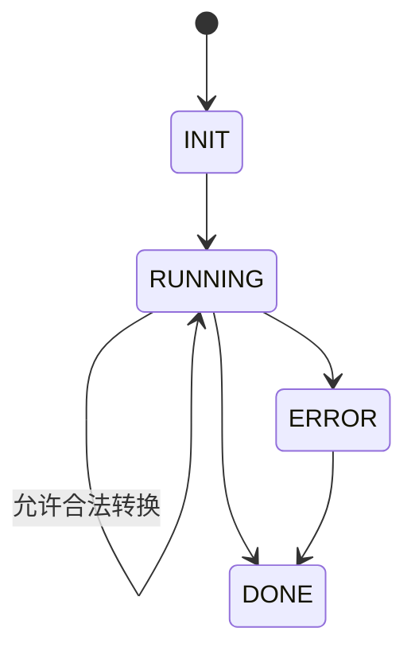

# Utils (工具函数)

通用工具库，按功能分类组织，统一为主服务提供可复用能力。

## 目录结构

```
utils/
├── bot/            # 机器人相关工具（上下文、名称等）
├── cache/          # 缓存装饰器与工具
├── rate-limiting/  # 请求限流
├── sse/            # SSE 客户端
├── state-machine/  # 通用状态机
├── text/           # 文本处理（分词、格式化等）
└── ...
```

## 状态机（Mermaid）



- 支持：转换合法性校验、必需处理器等待、并发队列、状态栈与上下文元数据
- 用途：复杂流程（例如聊天状态机、卡片生命周期流）的统一抽象

## SSE 客户端

- 自动重连与重试：失败后按策略重试；支持自定义次数与间隔
- 流解析：兼容不同换行符，支持多 data 行合并后 JSON 解析
- 清理函数：返回关闭连接的函数，便于上层控制生命周期

## 文本处理

- toMarkdown：渲染消息为 Markdown，考虑群下载权限
- jieba 分词：生成词云与统计词频
- 过滤：去除 emoji、超链等噪音

## 相关文档
- 缓存：请见 main-server/src/utils/cache/README.md
